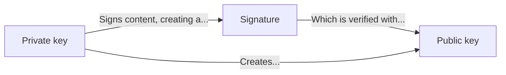
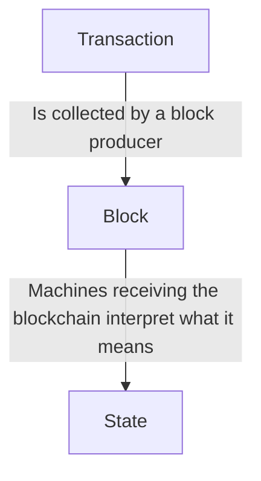
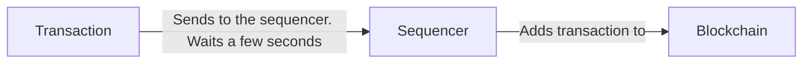
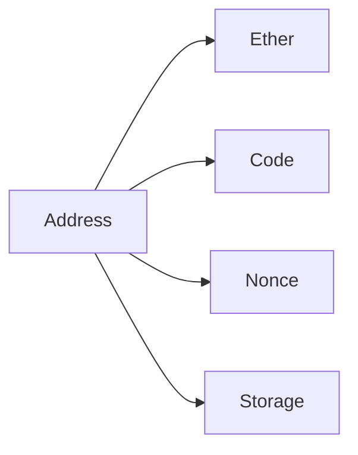
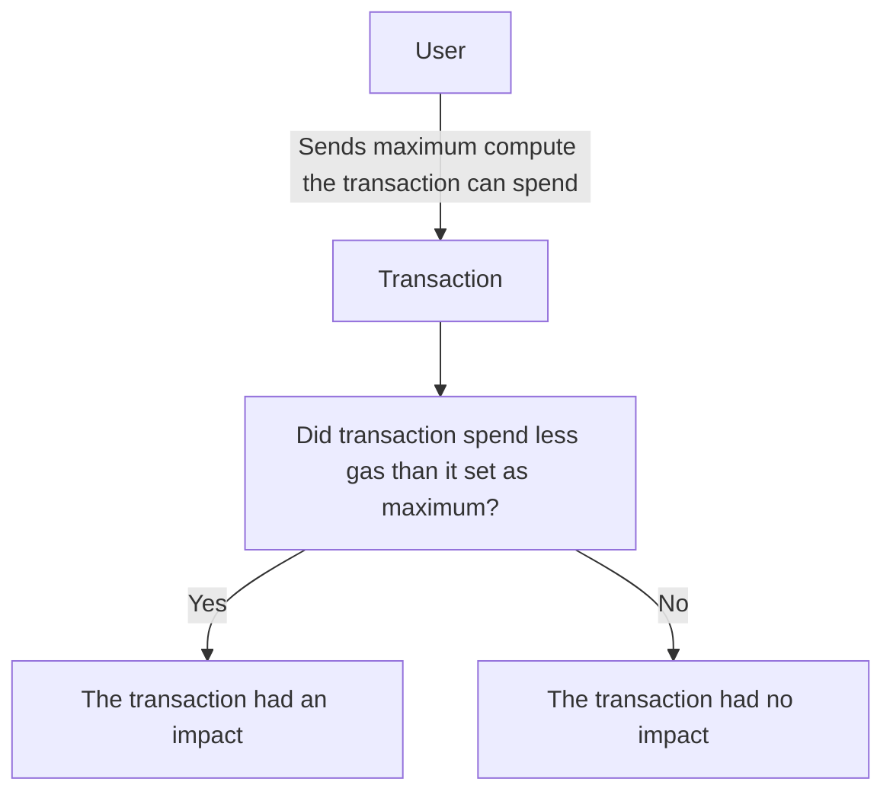

# Stylus for beginners

In this article, we’re going to build a fake blockchain, implement a stack machine to
illustrate how Webassembly works, and show off how the Arbitrum blockchain works using
what we learned as a guide.

We expect readers to have a basic undergrad software background, and to be able to read
typed code written in Typescript, recursive code in Python, and simple Rust code.
Typescript and Python will be used interchangeably to explain how a virtual machine works,
and Rust will be used to write Stylus smart contracts.

This introduction will not assume the reader is familiar with the concept of a smart
contract and what a blockchain is.

# Introducing our fake blockchain

A blockchain is a recursive data structure (or, structured commit log), of
cryptographically signed blobs with attribution to whomever added the blob, verifiable
with public-private key cryptography. We’ll explain what public-private key cryptography
is soon, so don’t worry.

In our example code, commits are referred to as transactions. The recursive data structure
(or, state machine), is summed by a program that remembers what it has seen to generate an
end application state.

Imagine a calculator state machine that we’ll turn into a blockchain. Borrowing some Go
syntax, the calculator state could look like the following:

```typescript
interface Transaction {
  Op: Op;          // operation code
  No?: number;     // optional immediate value
  C?: Transaction; // nested next transaction
  Before?: any[];  // preceding context items (mixed types)
}
```

With several operations that operate on the previous state:

```tsx
enum Op {
  Push = 0,
  Add,
  Mul,
  Div,
}
```

When the `OpPush` operation is used, we provide a number that is used in our transitive
storage of the operations. So, to create a formula of `10 + 20 * 30` (with the end result
being `610`), our state machine would look like the following:

```tsx
const example1: Transaction = {
  Op: Op.Add,
  C: {
    Op: Op.Push,
    No: 10,
    C: {
      Op: Op.Mul,
      C: {
        Op: Op.Push,
        No: 20,
        C: {
          Op: Op.Push,
          No: 30,
        },
      },
    },
  },
};
```

The equivalent to the above is:

```tsx
10 + (20 * 30)
```

A program could pattern match recursively the structure and find the answer pretty
quickly. But, the above is just a state machine. How do we turn it into a blockchain?
Using our above example, let’s add four more fields:

```typescript
interface Transaction {
  Op: Op;                   // operation code
  No?: number;              // optional immediate value
  C?: Transaction;          // nested next transaction
  Before?: any[];           // preceding context items (mixed types)
  SubmitterPubKey?: string; // 65-byte public key (hex-encoded)
  R?: string;               // 32-byte signature R (hex-encoded)
  S?: string;               // 32-byte signature S (hex-encoded)
}
```

These fields are used to interact with public-private key. Public-private key cryptography
is a cryptographic system to prove that someone, known by their public key, created the
content that we wanted to verify is theirs.

## Public-private key cryptography

In our below example, we’ll work with a type of Elliptic Curve Cryptography (ECC) called
the secp256k1 system.

Private keys are random bytes that were chosen by your computer. Private keys create
Public keys, a combination of the aforementioned random bytes chosen, combined with the
hardcoded Generator point for the Elliptic Curve System in use, for us the secp256k1
system, a very large number.

Public keys are created like this:

$$
public\ key = random\ bytes \cdot G
$$

Public keys are used to prove that the private key attested something: imagine that you
were to make a proclamation like “I love dogs!”: you could create a cryptographic proof
that you said that statement by signing it using your private key.

The multiplication above is a type of operation called modular arithmetic over a finite
field. It differs from ordinary multiplication: it’s a completely different system that we
won’t elaborate on for now.

So this means that the owner of the private key can sign data, and whoever possesses the
public key at the time can validate the public key signed the data. To recap:

- **Private keys**: create public keys and sign content to produce **signatures**.

- **Signatures:** cryptographic proof that the owner of a **public key** created the
content that was signed.

- **Public keys**: created from the private key



You might imagine that this system is useful for banking and for voting (for example).

What does a signature look like? Let’s write some Go code. Go has great library support
for working with the signature type we’re discussing here. The following code will emit
private keys, public keys that are compressed in size, and signatures:

```
package main

import (
	"bytes"
	"crypto/ecdsa"
	"crypto/rand"
	"crypto/sha256"
	"fmt"
	"os"

	ethCrypto "github.com/ethereum/go-ethereum/crypto"
)

func main() {
	// Read from stdin, saving it to a buffer:
	var buf bytes.Buffer
	if _, err := buf.ReadFrom(os.Stdin); err != nil {
		panic(err)
	}
	// Use the system randomness to generate random bytes
	// for our private key:
	prkey, err := ethCrypto.GenerateKey()
	if err != nil {
		panic(err)
	}
	// Which we print using hex to stderr:
	fmt.Fprintf(os.Stderr,
		"private key: %x, pubkey: %x\n",
		prkey.D,
		ethCrypto.CompressPubkey(&prkey.PublicKey),
	)
	// Later to create a sha256 signer, which we feed the
	// input from stdin into to create a digest:
	x := sha256.New()
	if _, err := buf.WriteTo(x); err != nil {
		panic(err)
	}
	// Finally, we sign the input we provided from stdin:
	r, s, err := ecdsa.Sign(rand.Reader, prkey, x.Sum(nil))
	if err != nil {
		panic(err)
	}
	fmt.Printf("r: %v, s: %v\n", r, s)
}
```

We needed the `go-ethereum` code since the secp256k1 curve is not supported by the Go
standard library. Private keys are only able to be used to sign blobs that are hashed, a
transformation that we apply to the data called hashing.

Hashing is the process of taking data, then applying transformations on it until it fits a
specific size that is unique to the data that was inputted. The most common hashing
strategy is sha256, which you may have seen in other places involving file integrity.
Hashing isn’t just important for integrity of data: it’s essential to coming up with keyed
datastructures including maps and hashtables, pointer protection, and more. With the
secp256k1 signature system in the Go code, we use sha256.

If we run this code, the program output would be:

```bash
b % ./private-key-picker
hello
private key: 5fe1956dc65de3c7b6cae1cdd4078672c0ce75e9a9138cdd95e39e1fd99e692d, pubkey: 02307380e710633086506f0b5d9878fb91e19f574caf749bcf5ae23cfc50495fe8
r: 46675391592507098461744368311622675236959728188104541593922010388651068885271, s: 71421556357399114972604334027290112648460025933014628472725999421029190949770
```

This Go program, using the randomness source on whatever operating system it runs on (in
my case, the nonblocking virtual file `/dev/urandom` ) reads some random data that’s then
used to create the private key. After creating the private key, it also created a public
key using finite field arithmetic. In the Go code that we wrote from above, we’re making
use of a cryptographic library called BoringSSL, a fork of OpenSSL, that the Go code FFI’s
into.

Once it’s done that, it takes the standard input that we provided to the program (in our
case, “hello\n”), and signs it. We won’t touch on signing here, but note that it’s an
involved mathematical operation.

Let’s note that with secp256k1, uncompressed public keys are 65 bytes (520 bits) large.
Private keys are 32 bytes (or 256-bit) large. In our above program, we’ve returned an
abbreviated public key that’s 33 bytes large, after the compression pass that took place.
The first byte is an indicator about how to derive the public key, which again we won’t
dive into.

A signature is made up R and S values. We use these two values to recover a signature to
get the public key of the signature (this operation is known as `ecrecover`). When it
comes to R and S, they’re similarly large (256 bits) large. To keep the signature scheme
hard to defeat where someone could get the public key by estimating private keys, this
signature scheme is hard for processors to derive public keys with.

How could we apply this program and signature scheme to the system from above? Let’s sign
the input to the machine above, using JSON as the encoding method:

```bash
b% echo -n '{"op":0,"no":30}' | ./private-key-picker
private key: 8b58f9b91384a9b4edcd33e87b5ee4b06d99e0840ff7e55d9efe93422699f633, pubkey: 02f3e02d856255ed62a63d31d60d3097a343fb9d57b1820034ab5b1a911e9ed8a8
r: 96160680372721079114515954144798968965976538873393357704671109455747708845508, s: 106340575424520363008010994198042967461407413579147027606774442838620301825513
```

This would let us create the transaction object from before like this:

```tsx
const example2: Transaction = {
  Op: Op.Push,
  No: 30,
  SubmitterPubKey: "02f3e02d856255ed62a63d31d60d3097a343fb9d57b1820034ab5b1a911e9ed8a8",
  R: "96160680372721079114515954144798968965976538873393357704671109455747708845508",
  S: "106340575424520363008010994198042967461407413579147027606774442838620301825513",
};
```

The R and S fields are base 10, though they might have been encoded with hex for the same
effect (we just haven’t here). Anyone can make use of the R and S fields within this
system to validate that the author of each Transaction blob for the calculator, the public
key, created the op and number here for addition.

How do we give our blockchain meaning? We chose the calculator example, since it’s a state
machine everyone understands that may or may not depend on being commutative (able to take
arguments independently). Let’s extrapolate it further.

## What are transactions?

We need to figure out a system to guarantee the order of operations prior to someone
adding to the history. We can’t have someone supplying an operation to perform a division
when the inputs aren’t what we expect!

The simplest solution is to ask the users to sign the content or the hash of the previous
blob in the chain, enforcing ordering to keep our system consistent.

If we were to do the sign the final step in the operation chain from before, but this time
unlike the previous example of just the inputs the user is immediately responsible for we
include everything that came before:

```shell
b% echo -n '{"op":1,"c":{"op":0,"no":10,"c":{"op":2,"c":{"op":0,"no":20,"c":{"op":0,"no":30}}}}}' | ./private-key-picker
private key: c5406d7b5e55aa41352a96f5772641e6cb446b0a4109e451555acfdb8ca320fb, pubkey: 027956e423088cbf5cd3896d979abaf681c153c02292a8d29856fc07358e022a7c
r: 109490587954065224018665916114696439326893613653236139668140228769916996904930, s: 52847444640315674408619378992306125231504692620405526333529832338143970682812
```

We could only append to the chain with a valid signature so it’s not possible to
reconstruct our step in the calculator chain with something that the signer didn’t expect.
Using the previous input, including the signature guarantees some level of consistency
here with history.

This works well, but there’s an issue with this system: these steps form the basis of what
takes place in our chain (”on-chain”), but they require “liveness” from the senders of the
data here. The signer of the step in the calculator chain must be online to sign the
previous interaction into their signed blob.

If we could do this in a way where the signer identified constraints instead of specifying
literally what it wants before it, it would be better. This way we’re not beholden to a
specific configuration beyond the scope of what the user is presumably trying to add.
Someone could easily specify that they’re expecting a specific number was supplied before.

We would need to translate our calculator system to resemble the following:

```tsx
const example3: Transaction = {
  Op: Op.Add,
  Before: [Op.Push, 10],
  C: {
    Op: Op.Push,
    No: 10,
    Before: [Op.Mul],
    C: {
      Op: Op.Mul,
      Before: [Op.Push, 20],
      C: {
        Op: Op.Push,
        No: 20,
        Before: [Op.Push, 30],
        C: {
          Op: Op.Push,
          No: 30,
        },
      },
    },
  },
};
```

This affords us an opportunity to say what came before our step in the chain of
interactions. But the problem here is that we can’t constraint perfectly what came before
without knowing ahead of time clearly what we expect. Over time the inputs would blow out
exponentially.

Let’s flatten the structure to explain how we might improve on this by improving the
flexibility of the constraints we use. Let’s add another layer of type above it to act as
a container, a “block” for the recursive transaction type by redefining it:

```tsx
interface Transaction {
  Op: Op;                   // Operation code
  No?: number;              // Optional immediate value
  Before?: any[];           // Constraints for previous calculator operations
  SubmitterPubKey?: string; // Transaction public key (hex encoded)
  R?: string;               // R part of the signature for this transaction
  S?: string;               // S part of the signature for this transaction
}

interface Block {
  Transaction: Transaction[];  // Transactions in theb lock
  B?: Block;                   // Next block
  BlockProducerPubkey: string; // Hex encoded public key
  R: string;                   // R part of the signature
  S: string;                   // S part of the signature
}
```

This new container type is the Block, the essential container for a blockchain, containing
transactions. This is better, this improves on the existing chain of transactions that we
made up by specialising a specific producer of the history, the Block producer (the one
who signs the blocks).

It affords the transaction signer the opportunity to work non-interactively with this
system by not requiring liveness (they can sign a blob and disseminate it with the other
people interested in this chain): they can just sign the transaction they want like this:

```bash
b % echo -n '{"op":0,"no":20,"before":[0,30]}' | ./private-key-picker
private key: f58dd4d235754c9fc2750d2e55e1ba67638a0a5f3d41cf931400209fc6b92f6, pubkey: 024f476e1b9368ae50ab34573bc7b0be7c590c9f634796d4e0ad072d8b21108ba1
r: 13701538462231091527866200836950950743407758947180296657773133663066990370872, s: 113336431400841648482223458012748904845724013047034353917738642742656731282990
```

Then share it to the Block producer:

```bash
# Note that I've not included in the transaction object the public key
# for the signer for brevity reasons:
b % echo -n '{"transaction":[{"op":2,"before":[0,30]}],"b":{"transaction":[{"op":0,"no":20,"before":[0,30]}],"block_producer_pubkey":"0385550d6b0cb13676a6769db36b775b8d49a1be71f6449f8785cd73bc1ffd8e3d","r":"86030860734043180344371311626322149138169356980983536493285126474363242170697","s":"86030860734043180344371311626322149138169356980983536493285126474363242170697"}}' | ./private-key-picker
private key: 5c8b95f23979f3f6e3c70f502ddfdd8f26eb94cb5c9ec8e82d514f79785f6f54, pubkey: 0306271c7a9957cef4b34be8627b9a56580593a187d799c478324e2dbae64ca704
r: 58746628405342652628129852483027334912560882418649680529364128475182863919908, s: 37375918562291893242652039551230332408939357744305368896508701819625797352813
```

Which would result in this layout:

```tsx
const block: Block = {
  Transaction: [
    {
      No: Op.Mul,
      Before: [Op.Push, 30],
      SubmitterPubkey: "...",
      R: "...",
      S: "...",
    },
  ],
  B: {
    Transaction: [
      {
        No: Op.Push,
        SubmitterPubkey: "...",
        R: "...",
        S: "...",
      },
    ],
    R: "...",
    S: "...",
  },
  R: "...",
  S: "...",
};
```

Users of the calculator system still struggle with the problem of the chain of operations
being able to be reordered in a way that distorts the calculator’s desired state by the
signers.

With the block structure though, we trust the submitter to order things in a way that we
like. But how can we improve the granularity of the constraints we want to establish with
the calculator?

## How can we have programmability on our blockchain?

Let’s discuss programming languages on our blockchain. We want our blockchain to have some
way of checking if the state in the blockchain is what we expect. The easiest way is to
introduce a machine for people to program with that we emulate on the fly to enforce the
constraints and even add to the current state of the operations.

One of the best machines we can implement is a stack machine. A stack machine is a
programming paradigm where a CPU (on the metal, or otherwise) reads from a tape of
operations (the code), which it uses to manipulate a separate queue of operations, aka the
stack. It’s one of the best options to implement since it’s one of the simplest.

A simple stack machine that functions like a calculator might be the following:

```
PUSH 0x1e0f3
PUSH 0x1c8
ADD
RETURN
```

This stack machine puts two items on the stack, the number `123123` (`0x1e0f3`) and `456`
(`0x1c8`), and it adds them together. An interpreter for our simple stack machine might
work like this in Python, also supporting some branching:

```python
def execute(code, stack = None, pc = 0):
	(op, imm) = code[pc]
	match op:
		case "PUSH":
			return execute(code, (imm, stack), pc + 1)
		case "ADD":
			x = stack[0]
			y = stack[1][0]
			return execute(code, (x + y, stack[1][1]), pc + 1)
		case "RETURN":
			return stack
```

The Python uses tuples and recursion to implement our simple machine simply. If we were to invoke it like this:

```python
if __name__ == "__main__":
	code = [
		("PUSH", 123123),
		("PUSH", 456),
		("ADD", None),
		("RETURN", None)
	]
	print(execute(code))
```

We would get the result `123579`. To achieve our goal of regulating the chain’s state
using the stack machine, let’s add to our stack interpreter to add jumps with branching,
and a feature to explicitly set the program counter (where in the list of instructions we
read from).

Our new stack feature adds a GT operation which checks if the value at the top of the
stack is larger than the value next on the stack. Our stack program also returns the
return status of the program as a tuple now, which we can use to check if the program
executed correctly.

```shell
def execute(code, stack = None, pc = 0):
	(op, imm) = code[pc]
	match op:
		case "PUSH":
			return execute(code, (imm, stack), pc + 1)
		case "ADD":
			x = stack[0]
			y = stack[1][0]
			return execute(code, (x + y, stack[1][1]), pc + 1)
		case "RETURN":
			return (stack, True)
		case "GT":
			x = stack[0]
			y = stack[1][0]
			return execute(code, (x > y, stack[1][1]), pc + 1)
		case "JUMPIF":
			dst = stack[0]
			x = stack[1][0]
			pc = pc + 1
			if x:
				pc = dst
			return execute(code, stack[1][1], pc)
		case "REVERT":
			return (stack, False)
```

We could now implement a program that checks if the head of the stack is larger than 10:

```python
if __name__ == "__main__":
	code = [
		("PUSH", 2),
		("PUSH", 10),
		("GT", None),
		("PUSH", 6),
		("JUMPIF", None),
		("RETURN", None),
		("REVERT", None)
	]
	print(execute(code))
```

Which returns `(None, False)`after jumping to REVERT. If revert did not come to pass (the
value is less than 10), we would’ve reached the return statement by simply passing the
jump operation.

This example is interesting, but it is deterministic and has no value for us. We need some
way to pass in code from the broader blockchain context. Perhaps some lookback features to
ask what was in the previous transactions?

Let’s add a feature that lets us check what the currently accumulating value in the
calculator is, using an operation called `CURBLOCKVALS`.

```python
def execute(calc_acc, code, stack = None, pc = 0):
	def loop(stack, pc):
		(op, imm) = code[pc]
		match op:
			case "PUSH":
				return loop((imm, stack), pc + 1)
			case "ADD":
				x = stack[0]
				y = stack[1][0]
				return loop((x + y, stack[1][1]), pc + 1)
			case "RETURN":
				return (stack, True)
			case "GT":
				x = stack[0]
				y = stack[1][0]
				return loop((x > y, stack[1][1]), pc + 1)
			case "JUMPIF":
				dst = stack[0]
				x = stack[1][0]
				pc = pc + 1
				if x:
					pc = dst
				return loop(stack[1][1], pc)
			case "REVERT":
				return (stack, False)
			case "CURBLOCKVALS":
				return loop((calc_acc, stack), pc + 1)
	return loop(stack, pc)
```

Note that in the above we add a new argument, `calc_acc`. `calc_acc` is the accumulated
value on the blockchain of the previous calculator operations. Armed with the above, we
could amend our example from earlier to include this operation:

```python
if __name__ == "__main__":
	cur_calc_state = 30
	code = [
		("PUSH", 10),
		("CURBLOCKVALS", None),
		("GT", None),
		("PUSH", 6),
		("JUMPIF", None),
		("RETURN", None),
		("REVERT", None)
	]
	print(execute(cur_calc_state, code))

```

This way of getting information in from the outside world lets us implement code that acts
as a restriction for the state that enters the blockchain. This could be very expressive,
depending on what we support. Indeed, the Solidity and Vyper programming languages compile
to a stack-based language, and as you’ve seen, the sky’s the limit with what’s possible to
build!

Returning to our example, what if we actually changed it that the transactions no longer
include the value we want to append to the blockchain state, but instead the stack
language appends the state itself?

That would be a very interesting idea, as it would expand the scope of the functionality
our machine supports. We could have the code RETURN the value that it has, using the last
item on the stack. That would invert the calculator concept! This adds feasibly infinite
programmability to our machine.

Let’s add a simple operation that just adds to the chain a number:

```
PUSH 10
RETURN
```

This would simply add “10” to the chain. Let’s bake this stack language into our
transaction system from before:

```typescript
interface Stack {
  Op: string;
  Val: number;
}

interface Transaction {
  Code: Stack[];
  SubmitterPubKey: string;
  R: string;
  S: string;
}
```

Note that Transaction now no longer includes the Op and Val fields, only now having a
stack. It would look like this possibly:

```typescript
const tx: Transaction = {
  Code: [
    { Op: "PUSH", Val: 10 },
    { Op: "RETURN", Val: 0 },
  ],
  SubmitterPubkey: "...",
  R: "...",
  S: "...",
};
```

So if we wanted to add some code that multiplies the current machine by 100 if the number
is more than 123, we could leverage a `MUL` operation that we’ll just assume exists here:

```tsx
// We'll emit from below the R, S, V, and public keys:

const block: Block = {
  Transaction: [
    {
      Code: [
        { Op: "CURBLOCKVALS", Val: 0 },
        { Op: "PUSH", Val: 123 },
        { Op: "GT", Val: 0 },
        { Op: "PUSH", Val: 6 },
        { Op: "JUMP", Val: 0 },
        { Op: "REVERT", Val: 0 },
        { Op: "PUSH", Val: 100 },
        { Op: "MUL", Val: 0 },
        { Op: "RETURN", Val: 0 },
      ],
      SubmitterPubKey: "",
      R: "",
      S: "",
    },
  ],
  B: {
    Transaction: [
      {
        Code: [
          { Op: "PUSH", Val: 1000 },
          { Op: "RETURN", Val: 0 },
        ],
        SubmitterPubKey: "",
        R: "",
        S: "",
      },
    ],
    BlockProducerPubkey: "",
    R: "",
    S: "",
  },
  BlockProducerPubkey: "",
  R: "",
  S: "",
};
```

So this would set `1000` to the blockchain state, which the following program would then
check to see if it’s greater than 100, and if it is, then it would multiply it by 100. But
only if RETURN ends up taking place! If REVERT happened, then we could presumably just NOT
add to the history.

With this stack-based system, we can see it’s possible to create circumstances which
separate the participant from their liveness in the system. Looking back at what we’ve
shown off here:

1. In a blockchain, people sign and share transactions, where they’re included in a
history of things that took place, before being aggregated together to produce a final
state: blockchains are state machines where the history is signed by people participating.
2. We’ve established that a specialised producer of history for the blockchain is titled a
block producer, and they aggregate transactions, which are loaded sequentially by whoever
is responsible for the history at the time. 3. We’ve established that we can implement a
stack machine to have programming on our blockchain, to have state that’s predicated on
what’s been included before.

Visual recap:



# Introducing a real blockchain (Arbitrum)

Let’s introduce Arbitrum and how it differs. Arbitrum is a “Ethereum Virtual Machine (EVM)
equivalent” blockchain with a centralised producer of blocks. EVM-equivalence is support
for the EVM stack language, and support for the calling conventions and storage
functionality of the EVM.

For our purposes of explanation, we’ll be discussing how the machine works and the
operations the machine provides by way of the explanation with Stylus, but not the EVM and
its implementation itself.

With Arbitrum, when it comes to blocks, the centralised producer of thme is the sequencer.
Arbitrum works on a First In First Out (FIFO) order of operations, with a fastlane that
can be rented to have exclusive access to for a period of time. Block production resembles
this diagram:



## How does Arbitrum work?

Arbitrum, like our machine from before, supports a stack machine with ways to get
information into the machine as it runs after being instigated from the transaction. This
information can be the signer of the transaction, and information derived from an entity
on Arbitrum called the Account.

## Accounts

The Account is a collection of bits of information. On Arbitrum, stack code isn’t sent in
the transaction, it’s included on-chain following a special transaction, where it’s
associated with an Account.

Accounts have storage of the amount of a native cryptocurrency to Arbitrum, Ether is a
number associated with accounts that has symbolic meaning as the cryptocurrency that needs
to be exchanget to do things on Arbitrum.

To prevent abuse, Accounts also have a counter of the previously send transactions called
the nonce. This is used to derive the location of new smart contracts when code is
submitted, and to prevent a situation where someone simply resends a transaction and its
signature to the chain. This prevents consequences where the signature of a transaction to
the effect of “I send Jack $100” can’t be simply resent to make Jack very rich. Instead
the transaction would be to the effect of “I send Jack $100 (nonce 0)”, and the nonce is
remembered to have been used.



Arbitrum identifies accounts by their public key, which it converts to a special format
called an address. What’s an address, why are Accounts addressed by it? When we introduced
public keys earlier, they were 65 bytes large. It’s possible to reduce the size somewhat
safely to 20 bytes by taking the public key we introduced earlier, taking it and then
hashing it. Arbitrum uses another hashing function that we don't use in the code from
above, keccak256.

To do this, we need to take the public key in its uncompresed form, prune the first byte
(which is used to indicate that the public key is compressed or uncompresed), and then
supply it to keccak256. We can then take the last 20 bytes from the result to have the
address. This system lets us save on space by paying a computation expense. This is the
action in progress:

```
keccak256(createPublicKey(randomBytes)[1:])[12:]
```

Arbitrum requires senders to pay to send transactions using the native cryptocurrency
Ether, with balances that it remembers using the accounts system. It functions like a way
of managing the cost for the blockchain sequencer to execute the transaction it was given.

Each operation that the machine performs costs gas, a unit of currency that’s programmed
by the Arbitrum VM to be set for every operation, which is multiplied by the price in the
transaction, converting it to Ether. So gas fulfills the role of being a simple unit to
say “doing this costs the Arbitrum sequencer this much in compute”.

```tsx
interface Transaction {
  ...
  GasAvailable: number; // The maximum units of gas we can spend
  GasPrice: number;     // The "price" of the gas that we multiply the gas available with to get the ether to spend with
  ...
}
```

$$
\text{ether\_paid} = \min(\text{maximum\_gas\_available}, \text{gas\_needed}) \times \text{gas\_price}
$$

Transactions might do complicated things, like perform financial math, or they might waste
time, so Arbitrum charges a fee to prevent abuse. This creates a situation where in a
rational system the amount of token spent on the system is greater than or exceeding the
external benefit the action created.

If they exceed the gas available in the transaction, the transaction will fail, and the
sender will pay all of the gas available multiplied by the gas price. So every time the
stack machine does something, it costs a fee that’s added up for the transaction to pay.

When transactions fail on Arbitrum, their effect on the rest of the blockchain’s state is
rolled back like it never took place, and the sender pays all the gas they provided for
the transaction. Each Arbitrum transaction causes gas to be spent.



This system of failing if we can’t afford to pay for it lets us protect ourselves from
situations with behaviour we can’t define by only allowing us to run code we understand.
Users using Arbitrum can estimate the gas costs ahead of time.

They can do this by asking an Arbitrum node for help. An Arbitrum node is a computer that
runs connected to the sequencer to try to guess what it will do next. The node will
estimate the costs ahead of time by running the code with unlimited gas but not persisting
any changes to the blockchain history, then reporting what it costs.

Ether is made available initially by sending it from another chain that Arbitrum is
connected to, Ethereum. We’re intentionally trying to avoid explaining the Ethereum
connection, so we won’t touch on how the connection of the token happens for now.

Finally, Accounts are optionally made up of code, which are invoked on demand by users by
addressing the Account using its address using transactions with Calldata included. These
Accounts have storage which the code can manipulate, which is a key-value addressable map
of EVM words (32 byte numbers).

### Transactions

Accounts that lack code, aka Externally Owned Accounts, send transactions. Transactions
that interact with the chain in their basic form look like this on Arbitrum:

```typescript
type Address = string;  // 20 bytes  40char hex (or "0x" + 40 hex)

interface Transaction {
  Target: Address;      // Account that will receive this calldata or Ether
  Calldata: string;     // Bytes that the target can process when being invoked
  Nonce: number;        // What number this transaction is for the Account
  GasAvailable: number; // The gas that we can spend in this transaction
  GasPrice: number;     // The price of the gas that we multiply the gas spent to get the ether cost
  R: string;            // Hex-encoded part of the signature (R)
  S: string;            // Hex-encoded part of the signature (S)
  V: number;            // Parity for the signature
}
```

Let’s explain these values. The **Target** is the recipient of the **Calldata** content,
which is interpreted by the code at the address given if a smart contract lives there.

**Calldata** is arbitrary content that’s put on-chain, and if the **Target** is not
supplied, is processed like a smart contract creation. A smart contract creation is the
execution of the Calldata for the purpose of creating a new smart contract that lives at
an address we derive from the sender of this transaction.

The **Nonce** is a count of the amount of transactions users have submitted in the past.

The **Gas Available** is units of gas that can be spent for the operation to happen. The
**Gas Price** is the multiplier for the units of gas that was spent for each operation in
the transaction’s code so we can convert the gas that was spent to Ether in how we charge
the sender.

Returning to the **R**, **S**, **V** values: V is a compression technique we’ll leverage
with the elliptic curve cryptography to avoid having to supply the public key in the
transaction. It lets us perform a special type of recovery by using the V value as the
“parity value”. But we won’t get into this, just know that with this field we can avoid
having to provide the transaction signer’s public key, so we can safely omit it. Think
about it like the public key field: it saves the amount of information that we have to
pass around.

### What’s a smart contract?

This transaction system differs from the stack language embedded in transactions, in that
the stack code that’s executed is not in the transaction. It is code that was saved
on-chain, that’s addressable by the target field. This is a smart contract! It’s a bit of
code that has its own balance, and its own way of being addressed.

At any point, someone could have created smart contract code like so:


```go
// We omit several fields:

Transaction {
	Calldata: []byte{0x60, 0x07, 0x80, 0x60, 0x09, 0x3d, 0x39, 0x3d, 0xf3, 0x36, 0x5f, 0x5f, 0x37, 0x36, 0x5f, 0xf3},
}
```

The code in the transaction here creates a new smart contract with code that returns the
content in `Calldata` back to the user.

This contract was created at a address, derived from the sender’s public key keccak hashed
with the Account’s nonce field (which should be equal to the transaction’s nonce). The
nonce is a count of the amount of transactions that were sent by the owner of the public
key.

So, if we were to have the address `0x09fe2a16951fdb076a1d331e7f9227ebf0d8e6c1`, and we
were to deploy a contract, and it’s the first transaction for this address so the nonce is
0, we would end up with the contract deployment here:


```
keccak256(pack(0x09fe2a16951fdb076a1d331e7f9227ebf0d8e6c1, 0))[12:] = 0x671687fb252f7581D8CFbc9A00009B0c4C3cc916
```

Which would then have the code we just deployed there. What happens when someone invokes
the contract we just deployed? They would send a transaction like this:

```go
// Transaction has several fields being omitted here for brevity:
Transaction {
	// Target being set with addr simply decodes hex.
	Target: addr("671687fb252f7581D8CFbc9A00009B0c4C3cc916"),
	Calldata: bytesX("code here")
}
```

As a reminder: the calldata is a stream of bytes that we provide in the transaction that
the contract can read from within its execution.

```tsx
0x60, 0x07, 0x80, 0x60, 0x09, 0x3d, 0x39, 0x3d, 0xf3, 0x36, 0x5f, 0x5f, 0x37, 0x36, 0x5f, 0xf3
```

Is equivalent in EVM assembly (that we won’t cover here, since we’re focusing on Stylus
and WASM) to creating a contract that returns the same input. It would return the same
calldata we sent it, like an echo.

# How does Arbitrum execute code?

Arbitrum supports two machines that it can run for code execution. The first is the EVM,
which we won’t cover here. The second is Arbitrum Stylus, powered by Webassembly.

## What’s Webassembly (WASM)?

Webassembly is a stack-based instruction set architecture (ISA) leveraged by Arbitrum,
developed by a committee with members from Google, Microsoft, Fastly and Cloudflare that
sees its main adoption in the web browser and at edge compute.

WASM is used as a static binary translation layer. Translated: code that’s compiled to
WASM is translated then stored as a native executable (what your locral computer runs)
after an activation stage. In our fake blockchain example, we had a fake stack-based
language that we interpreted using Python. With WASM, the blockchain converts the code
ahead of time from the interpreted language to a separate program that it runs.

## Why?

Browsers are complex, with the amount of different features they support and the hosts
they run on, and WASM functions as a high performance drop in for browser scripting. The
V8 Javascript interpreter that runs on Chromium browsers (Brave, Chrome, etc) optimizes
several Javascript operations, and even ARM processors support an operation that’s
associated with Javascript, but interpreting Javascript (or any stack based languages that
don’t resemble the local machine, for that matter) will ultimately be less performant than
interpreting a instruction-based machine.

Compilers are complex enough to optimise languages to perform better when interpreted as
low-level code, though Javascript is a high level interpreted language, so it cannot be
optimised to the extent that a stack machine could be.

WASM is a target for the most popular compiler toolchain, LLVM. LLVM is a complier
toolchain that outputs executable (stack or register machine code) after translating it
from an intermediate representation. LLVM leverages several decades of optimisations and
improvements, and generated code generally is high performance and well optimised.

Webassembly simulators can leverage LLVM to alternate between just-in-time simulation of
Webassembly code (like our Python code), and direct translation to a local binary (like
Arbitrum).

WASM has static jumps and supports external functions, making it very suitable as a static
translation layer to a host machine like the way its being used here. The alternative,
dynamic jumps entirely taking place at runtime (without type aware indirect jumping), is
hard to optimise for and to provide with a static translation without a just in time
interpreter.

## How is WASM run on-chain?

The process of the Arbitrum node running WASM converted code on-chain is like this:


First, the programming language Rust is written so as to be is compiled to WASM using the
Rust compiler leveraging LLVM.

Second: the WASM code is sent on-chain using the transaction from earlier. This forms the
code section of the account for the address that we derived from the address and nonce.

Thirdly, the WASM code is converted to native code on the Arbitrum sequencer when a
transaction is sent that runs the activate smart contract. This step is the interaction
with the blockchain using the transaction sending format to ask it to do the conversion
for us.

Fourthly: we run the code we compiled to the native code. This is the standard process for
running code this way.

An example program in Rust that runs on-chain:

```rust
// A simple program that returns whatever it's given.

#![no_std]
#![no_main]

// When something terrible happens, the program will jump to this
// function to handle a problem and blow up if it can.
#[panic_handler]
fn panic_handler(_: &core::panic::PanicInfo) -> ! {
    core::arch::wasm32::unreachable()
}

// For us to interact with the broader blockchain, in the Rust
// programming language, we must use these functions:
#[link(wasm_import_module = "vm_hooks")]
unsafe extern "C" {
    fn pay_for_memory_grow(pages: usize);
    fn read_args(out: *mut u8);
    fn write_result(d: *const u8, l: usize);
}

// And we must define this function ourselves if we can. This function
// is kept to provide a reference to pay_for_memory_grow.
#[unsafe(no_mangle)]
pub unsafe fn mark_used() {
    unsafe { pay_for_memory_grow(0) }
    panic!();
}

// The actual entrypoint for our contract. WASM code starts running by
// the host running the WASM code addressing a specific function.
#[unsafe(no_mangle)]
fn user_entrypoint(len: usize) -> usize {
    let mut x = [0u8; 1024];
    assert!(x.len() >= len);
    unsafe {
        read_args(x.as_mut_ptr());
        write_result(x.as_ptr(), len);
    }
    0
}
```

This program does nothing but reply to the user with the calldata they were given. It
leverages a few external functions that interact with the blockchain state and the content
embedded in the transaction. When the binary is invoked by the sequencer that we compiled
our WASM to, the external functions that we provided here are linked by the sequencer.

When external functions are run, the code execution is given up to the host running the
code we provided, and taken over from the guest. These functions operate on memory
locations in the WASM code.

| Name | Description |
| --- | --- |
| `pay_for_memory_grow`  | This function pays for the allocation of new memory that we weren’t aware of ahead of time using gas. The activation step of converting the WASM code to native code translates the allocation of linear memory to call this function. It must be referred to as an external function and not removed by LLVM performing dead code elimination (the removal of things we don’t use), so the activation step knows how to replace the heap allocation code to use this. |
| `read_args` | This is a way to get from the transaction the calldata that was given for the target.  `read_args` can be invoked on any contiguous block of memory by using its pointer. |
| `write_result` | Sets the return value of the transaction for us to look at when we simulate the code, or to pass back to the contract that invoked the smart contract themselves. |

## How does WASM differ from the stack machine we showed off before?

This Rust was compiled to WASM code that we’ll dip into soon. The machines differ in a few
ways that we’ll explain here, with the machines in their simplest forms (no lookup table
is here for the WASM machine):

```tsx
interface EvmMachine {
  Code: Uint8Array;
  Stack: Uint8Array;
  Memory: Uint8Array;
  Pc: number;
  // Other information here like the sender's address, etc...
}

interface WasmMachine {
  Code: Uint8Array;
  OpStack: Uint8Array;
  LinearStack: Uint8Array;
  Variables: Uint32Array;
  Pc: number;
  Control: WasmControl;
}

interface WasmControl {
  From: number;
  Until: number;
  Next?: WasmControl;
}
```

There are a few differences here:

1. Changing the program counter (denoted as pc here) in the EVM is done using an operation
(`JUMP`) and is done by pointing to a specific location, much like our example VM from
before. The WASM machine jumps to a specific location using a label. This makes it
possible to predict branching, but it requires the interpreter to implement extra
complexity with a jump table.

2. There are two stacks in the WASM machine. One is a strictly operator stack, which is
useful for interim math operations. The other, the linear stack, is a contiguous allocated
block of memory ahead of time. The program declares the size of the stack ahead of time
when it’s loaded by its host for the first time, whereas the EVM machine grows.

3. The WASM machine also has a separate integer-addressed storage called the variables
layout. This is useful for interim operations as well.

4. On top of all the differences that the WASM machine has, it also has embedded in the
stack machine a custom control flow where it’s possible to have an indication of when the
current control frame ends, and where to jump out once things are completed. This is
implemented in the form of knowing where the control started, and ended. Once the ending
is reached in the program counter, then the code jumps to the previous frame. This is a
part of the structured control flow that WASM affords us.

Let’s address these things:

### What’s memory?

In our fictional stack machine, we worked entirely with the stack as a stream of
operations that are interpreted as the program has its life. Our stack machine from our
calculator example could be extended to have a way for it to store information outside of
the stack, or as its known, memory:

```rust
def mem_grow(ext, size):
	diff = size - len(ext)
	return ext + [0] * diff

def mem_insert(src, dst, offset):
	src = list(src)
	mem = dst
	if len(src) > len(dst) + offset:
		needed = len(src) + offset - len(dst)
		mem = mem_grow(mem, needed)
	return mem[:offset] + src + mem[offset+len(src):]

def execute(code, stack = None, pc = 0):
	def loop(stack, mem, pc):
		(op, imm) = code[pc]
		match op:
			case "PUSH":
				return loop((imm, stack), mem, pc + 1)
			case "RETURN":
				return (stack, mem, True)
			case "MSTORE":
				off = stack[0]
				val = stack[1][0]
				src = val.to_bytes(8, byteorder="big")
				return loop(stack[1][1], mem_insert(src, mem, off), pc + 1)
	return loop(stack, [], pc)
```

This is equivalent to the EVM’s linear memory, with the exception that our memory grows as
it’s used based on the offset, and we don’t align the memory that gets allocated. We don’t
ask for more memory, it becomes available as we go to use it. We chose big endian as the
encoding format for no reason other than on Arbitrum that’s the standard encoding
convention in calldata (WASM is a little endian machine).

The above machine could be manipulated like this:

```rust
if __name__ == "__main__":
	code = [
		("PUSH", 123),
		("PUSH", 0),
		("MSTORE", None),
		("PUSH", 456),
		("PUSH", 8),
		("MSTORE", None),
		("RETURN", None)
	]
	print(execute(code))
```

This code creates memory like the following:

```rust
[0, 0, 0, 0, 0, 0, 0, 123, 0, 0, 0, 0, 0, 0, 1, 200]
```

It encodes the integers it has on the stack to its linear memory as big endian. We could
have some code that manipulates our memory, like shifting it around, or using it as a
scratch space to store data.

### How does WASM leverage memory?

Let’s implement some basic code that manipulates linear memory. Unlike our first stack,
this stack is going to be byte aware (one item in the array is a byte) after encoding the
integers it goes to store:

```rust
def mem_insert(src, dst, offset):
	src = list(src)
	mem = dst
	return mem[:offset] + src + mem[offset+len(src):]

def execute(code, stack = [], sp = 32, pc = 0):
	def loop(sp, stack, pc):
		(op, imm) = code[pc]
		match op:
			case "SUBSPIMM":
				return loop(sp - imm, stack, pc + 1)
			case "SWIMM":
				src = imm.to_bytes(8, byteorder="big")
				return loop(sp, mem_insert(src, stack, sp), pc + 1)
			case "RETURN":
				return (stack, True)
	return loop(sp, stack, pc)
```

We also added a stack pointer register that remembers the location of where the linear
memory stack is currently operating on with the operations that we give the user. Before
the code works, we need to adjust the stack pointer to provide us with more space to store
the immediate word we have on the stack.

We added some operations that use the immediate value to manipulate the stack pointer.
These let us adjust the location of the code. We can use this like this:

```rust
if __name__ == "__main__":
	code = [
		("SUBSPIMM", 8),
		("SWIMM", 123),
		("SUBSPIMM", 8),
		("SWIMM", 456),
		("RETURN", None)
	]
	print(execute(code))
```

Which results in:

```rust
([0, 0, 0, 0, 0, 0, 0, 123, 0, 0, 0, 0, 0, 0, 1, 200], True)
```

### WASM’s use of variable storage

We showed off that the WASM machine also has a register of variables that it accesses by
integer. Let’s make an adjustment to our code to add some operations that work on the
registers as well as the linear memory:

```python
def execute(
	code,
	regs = [0] * 10,
	sp = 32,
	lin_stack = [0] * 32,
	pc = 0
):
	def loop(sp, regs, lin_stack, pc):
		(op, imm) = code[pc]
		match op:
			# Set the register to the content of the current top of the stack:
			case "REGIMM":
				regs[imm] = int.from_bytes(lin_stack[sp:sp+8], byteorder="big")
				return loop(sp, regs, lin_stack, pc + 1)
			# Reduce the stack pointer by the immediate value:
			case "SUBSPIMM":
				return loop(sp - imm, regs, lin_stack, pc + 1)
			# Store at the current linear memory location the immediate:
			case "SWIMM":
				src = imm.to_bytes(8, byteorder="big")
				return loop(sp, regs, mem_insert(src, lin_stack, sp), pc + 1)
			# Add the current value at the stack pointer with the register value
			# provided by the register:
			case "SREGADD":
				x = int.from_bytes(lin_stack[sp:sp+8], byteorder="big")
				y = regs[imm]
				z = (x + y).to_bytes(8, byteorder="big")
				return loop(sp, regs, mem_insert(z, lin_stack, sp), pc + 1)
			case "RETURN":
				return (lin_stack, regs, True)
	return loop(sp, regs, lin_stack, pc)
```

This code starts with a 32 byte linear memory that won’t grow, 10 registers, and a stack
pointer set to 32. You can see that with WASM’s registers format, we can add a version of
our existing operations to get more data in beyond the immediate value. This lets us avoid
complex stack manipulation operations. Stack manipulation when you only have the stack
sucks! We can keep our operations small this way, by only allowing one immediate value.
Indeed:

```python
if __name__ == "__main__":
	code = [
		# First, reduce the stack pointer that started at 32 by 8:
		("SUBSPIMM", 8),
		# Store at the linear memory the number 123, a uint64 so 8 bytes:
		("SWIMM", 123),
		# Take the word at the current stack pointer and set to register 2,
		# aka set 123:
		("REGIMM", 2),
		# Let's set to the same stack location another value:
		("SWIMM", 81291),
		# Add the current register value at 2 to the top value of the stack,
		# then set to the 2 register:
		("SREGADD", 2),
		# And return!
		("RETURN", None)
	]
	print(execute(code))
```

Results in:

```python
([0, 0, 0, 0, 0, 0, 0, 0, 0, 0, 0, 0, 0, 0, 0, 0, 0, 0, 0, 0, 0, 0, 0, 0, 0, 0, 0, 0, 0, 0, 0, 123], [0, 0, 123, 0, 0, 0, 0, 0, 0, 0], True)
```

Note that none of the above functions actually exist in the WASM machine, and instead
exist to show off the difference between the fake stack machine we made and WASM.

### WASM and the operand stack

WASM supports another stack beyond the linear stack. This secondary stack is called the
operand stack. It behaves like the original stack that we covered, with operands that
perform the equivalent of push and pop.

We’ve already seen how this works, but to recap the operand stack:

```rust
def execute(
	code,
	regs = [0] * 10,
	sp = 32,
	op_stack = [],
	lin_stack = [0] * 32,
	pc = 0
):
	def loop(sp, regs, op_stack, lin_stack, pc):
		(op, imm) = code[pc]
		match op:
			case "OPADD":
				x = stack[0]
				y = stack[1][0]
				z = x + y
				return loop(sp, regs, (z, stack[1][1]), lin_stack, pc + 1)
	return loop(sp, regs, stack, pc)
```

You could imagine how this is useful, with an operation that carries the op stack over to the variables registers, and the linear memory.

So to recap the machine that we’ve seen so far with WASM:

```tsx
interface WasmSoFar {
    OperandStack: Uint32Array;
    LinearMemory: Uint8Array;
}
```

Remember that WASM in the Arbitrum Stylus context has 4-byte (32 bit) words, so we need a
stack to store these numbers instead of a contiguous block of memory.

### WASM and structured control flow

WASM is a programming language with structured control flow: all locations are known ahead
of time for jumping. In our original stack language, it was based entirely arbitrarily but
with static destinations of the jump, being based on the stack.

Extending our machine, we can add explicit control flow.Let’s extend the code to include a
loop section and a if statement:

```rust
def execute(
	code,
	ctl,
	regs = [0] * 10,
	sp = 32,
	op_stack = [],
	lin_stack = [0] * 32,
	pc = 0
):
	def loop(sp, regs, op_stack, lin_stack, ctl, pc):
		(op, imm) = code[pc]
		match op:
			# Control flow statement that checks if the top of the operand
			# stack is true, and if it is enter the if statement block. If the
			# statement is false, enter the OFIFEND block that the control flow
			# tuple has.
			case "OPIF":
				(_, end, else_) = ctl[imm]
				next = None
				if op_stack[0]:
					next = pc + 1
				elif else_ is None:
					next = end
				else:
					next = else_ + 1
				return loop(sp, regs, op_stack[1], lin_stack, ctl, next)
			# No-op for illustration purposes.
			case "OPIFEND":
				return loop(sp, regs, op_stack, lin_stack, ctl, pc + 1)
			# Beginning of the branching for the else statement. If this is
			# encountered, we assume the if block preceding this was completed,
			# and jump out.
			case "OPIFELSE":
				(_, end, _) = ctl[imm]
				return loop(sp, regs, op_stack, lin_stack, ctl, end)
			# Push the immediate onto the operand stack.
			case "OPPUSH":
				return loop(sp, regs, (imm, op_stack), lin_stack, ctl, pc + 1)
			# Increment the top value of the operand stack.
			case "OPINCR":
				op_stack = (op_stack[0] + 1, op_stack[1])
				return loop(sp, regs, op_stack, lin_stack, ctl, pc + 1)
			# Begin to loop, preparing to wrap around using the control flow
			# identified by the immediate.
			case "LOOP":
				c = ctl[imm]
				ctl = ctl + [c]
				return loop(sp, regs, op_stack, lin_stack, ctl, pc + 1)
			# Jump back to the start of the loop.
			case "LOOPEND":
				(start, end, _) = ctl[imm]
				return loop(sp, regs, op_stack, lin_stack, ctl, start + 1)
			# Duplicate the top of the opersand stack.
			case "OPTEE":
				op_stack = (op_stack[0], op_stack)
				return loop(sp, regs, op_stack, lin_stack, ctl, pc + 1)
			# Pop the top of the stack, and check if it's larger than the
			# immediate. Push true or false based on this.
			case "OPGTIMM":
				op_stack = (op_stack[0] > imm, op_stack[1])
				return loop(sp, regs, op_stack, lin_stack, ctl, pc + 1)
			# Break the control flow that we're in based on the immediate.
			case "BREAK":
				(start, end, else_) = ctl[imm]
				ctl = ctl[:len(ctl) - 1]
				return loop(sp, regs, op_stack, lin_stack, ctl, end + 1)
			# Return.
			case "RETURN":
				return (regs, op_stack, lin_stack, ctl, pc, True)
	return loop(sp, regs, op_stack, lin_stack, ctl, pc)
```

This code can be invoked to loop, counting a number until it has more than 10, breaking
out:

```rust

if __name__ == "__main__":
	code = [
		# Push 1 onto the operand stack.
		("OPPUSH", 1),
		# Begin looping.
		("LOOP", 0),
		# Duplicate the current stack item.
		("OPTEE", None),
		# If the current top of the stack is greater than 10, append the answer.
		("OPGTIMM", 10),
		# If the previous statement is true, then enter the following statement.
		("OPIF", 1),
		# Break out of the current loop.
		("BREAK", 0),
		# If the statement above the OPIF operation is false, run from here.
		# If this is run into on its own, then we assume they completed, and
		# we jump to the OPIFEND operation.
		("OPIFELSE", 1),
		# Increment the current top of the stack.
		("OPINCR", None),
		# Doesn't do anything!
		("OPIFEND", 1),
		# Jump back to the start of the loop.
		("LOOPEND", 0),
		("RETURN", None)
	]
	ctl = [
		# Loop statement lasts from operation 1 and 9.
		(1, 9, None),
		# If statement lasts from 5 to 8 if it's true, or 8 to 6 if it's false.
		(5, 8, 6)
	]
	print(execute(code, ctl))
```

This code explicitly has control flow that’s not based on setting the program counter at
the end of the loop.

We’re unlike WASM in that we’ve explicitly added a section to the arguments that’s
responsible for the control flow here to make things simpler, this could have been
provided by a simple pass over a more structured program. Note that we didn’t enforce any
destination checks on the jumping, which an interpreter might do to make sure that the
code is correct. It uses the else label as a way to immediately take the user to the end
of the control flow, assuming they lived past the running of the main if branch.

This results in explicit control over the application’s looping, and easier conversion to
other languages, analysis, and safety. All of these features together is why WASM is
suitable as a high performance layer over existing high level technologies. Extra safety,
more information to compiler and interpreter authors, and more.

## WASM echo contract example

Now that we’ve introduced a fake machine with enough similarities to WASM to illustrate
how it works, let’s show off WASM compiled code. Remember this from earlier:

```rust
#[unsafe(no_mangle)]
fn user_entrypoint(len: usize) -> usize {
    let mut x = [0u8; 1024];
    assert!(x.len() >= len);
    unsafe {
        read_args(x.as_mut_ptr());
        write_result(x.as_ptr(), len);
    }
    0
}
```

This code is first converted from Rust to LLVM IR, then to WASM. We can use tools to
visualise the way the WASM looks after it’s been compiled. Note that we’ve made a
post-processing pass on this to eliminate some dead code:

```rust
(module
  (type (;0;) (func (param i32)))
  (type (;1;) (func (param i32 i32)))
  (type (;2;) (func))
  (type (;3;) (func (param i32) (result i32)))
  (import "vm_hooks" "pay_for_memory_grow" (func (;0;) (type 0)))
  (import "vm_hooks" "read_args" (func (;1;) (type 0)))
  (import "vm_hooks" "write_result" (func (;2;) (type 1)))
  (func (;3;) (type 2)
    i32.const 0
    call 0
    unreachable)
  (func (;4;) (type 3) (param i32) (result i32)
    (local i32)
    global.get 0
    i32.const 1024
    i32.sub
    local.tee 1
    global.set 0
    local.get 1
    i32.const 0
    i32.const 1024
    memory.fill
    local.get 0
    i32.const 1025
    i32.ge_u
    if  ;; label = @1
      unreachable
    end
    local.get 1
    call 1
    local.get 1
    local.get 0
    call 2
    local.get 1
    i32.const 1024
    i32.add
    global.set 0
    i32.const 0)
  (memory (;0;) 16)
  (global (;0;) (mut i32) (i32.const 1048576))
  (global (;1;) i32 (i32.const 1048576))
  (global (;2;) i32 (i32.const 1048576))
  (export "memory" (memory 0))
  (export "mark_used" (func 3))
  (export "user_entrypoint" (func 4))
  (export "__data_end" (global 1))
  (export "__heap_base" (global 2)))
```

This is a S expression representation of the outputted machine code. You can see that we
import the external functions that we imported earlier from the Stylus machine, and that
we export a function called “user_entrypoint” as `func 4.` We can see that we export
`mark_used` , which actually performs no purpose other than to ensure we have
`pay_for_memory_grow` exported by the WASM executable so as to be replaced later . All
external function invocation happens where a special operand stack working function called
`call` is invoked with the number of its target defined in the source code earlier.

Explaining further:

```rust
(func (;4;) (type 3) (param i32) (result i32)
  (local i32)    // Sets on the variable registers a zero int!
  global.get 0   // We get here the stack pointer onto the operand stack.
  i32.const 1024 // We push onto the operand stack 1024.
  i32.sub        // We subtract the stack pointer by 1024. [diff]
  local.tee 1    // We copy the top of the stack! [diff, diff]
  global.set 0   // And we set the stack pointer to the previous sp - 1024. [diff]
  local.get 1    // We get the content of a local register, 1. [len, diff]
  i32.const 0    // We push onto the stack the value 0! [0, len, diff]
  i32.const 1024 // And then we push 1024. [1024, 0, len, diff]
  memory.fill    // Which we finally pass to the fill operation. [diff]
```

This is our Rust code so far:

```python
let mut x = [0u8; 1024];
```

In that code, we’ve allocated a variable, the 1024 byte block of memory that we used to
read the calldata sent to this contract from, which we also set to 0 in the code.
Following that we:

```rust
// As we begin this program's life, we have on the stack [diff]
local.get 0       // We copy the length argument to user_entrypoint here! [len, diff]
i32.const 1025    // And we copy 1025 to the stack. [1025, len, diff]
i32.ge_u          // We do an unsigned comparison to see if length > 1025. [bool, diff]
if  ;; label = @1 // And if it is, then we call unreachable, which blows up! [diff]
  unreachable     // Equivalent to REVERT from our fake stack machine.
end
local.get 1       // We get the buffer pointer here for calldata to the operand stack! [buffer, diff]
call 1            // We call the code "read_args" now! We consume the buffer pointer. [diff]
```

So this code is equivalent to this Rust code:

```rust
assert!(x.len() >= len);
unsafe {
    read_args(x.as_mut_ptr());
```

Simple so far. We create memory on the stack, we zero it out with 0, then we call a
function that writes to it, with the argument that we load from the operand stack. The
compiler doesn’t know that we’re going to be spending the entire stack allocation, so it
zeroes everything out to avoid undefined behaviour.

We know from the type signature of `read_args` that we won’t get anything back from it, so
the stack will remain the same. Now we can invoke the `write_args` function:

```rust
// This code has on the stack the diff between the stack pointer and the length.
local.get 1    // We get the first variable that we have. [buffer, diff]
local.get 0    // We get the stack pointer. [sp, buffer, diff]
call 2         // We call the write args function. It takes two operand stack items. [diff]
local.get 1    // We get the buffer at the end of the program. [buffer, diff]
i32.const 1024 // We add 1024. [1024, buffer, diff]
i32.add        // We reset the stack pointer to where it started! [1024 + buffer, diff]
global.set 0   // We set the stack pointer back to where it was when we started!
i32.const 0    // Finally, we return 0 from the program! [0, diff]
)
```

So, in this program’s life, we set up the stack by decreasing it, we did our operation,
then we reset the stack. Cool! In the code above we specifically:

```rust
unsafe {
    write_result(x.as_ptr(), len);
}
0
```

Which literally just set the location of the buffer and the length as the return value.

## WASM example making use of storage

Let’s show off two more basic contracts making use of Arbitrum operations before we
proceed with the rest of the example suite. Reminder of the Accounts system:


Accounts each have a key-value addressed map that code associated with this account can
run. This is how we can persist storage access in the EVM. It might look like this in our
stack machine:

```rust
def execute(code, storage = {}, stack = None, pc = 0):
	(op, imm) = code[pc]
	match op:
		case "PUSH":
			return execute(code, storage, (imm, stack), pc + 1)
		case "SSTORE":
			key = stack[0]
			value = stack[1][0]
			storage[key] = value
			return execute(code, storage, stack[1][1], pc + 1)
		case "RETURN":
			return (stack, storage, True)
```

So this is just a boring key-value map situation that happens that we can manipulate
ourselves:

```rust
if __name__ == "__main__":
	code = [
		("PUSH", 123),
		("PUSH", 0),
		("SSTORE", None),
		("RETURN", None)
	]
	print(execute(code))
```

Which sets at slot 123:

```rust
(None, {0: 123}, True)
```

Returning to our WASM code, to interact with the storage key-value map that we get for
each address, we can use these external functions:

```rust
unsafe {
    fn storage_load_bytes32(key: *const u8, out: *mut u8);
    fn storage_cache_bytes32(key: *const u8, from: *const u8);
}
```

WASM uses the cache bytes function to enforce that our code isn’t capable of writing to
its storage for access control reasons (note the view method in Solidity from our last
article/workshop).

Which we can use like this to implement a simple counter smart contract:

```rust
#[link(wasm_import_module = "vm_hooks")]
unsafe extern "C" {
    fn pay_for_memory_grow(pages: usize);
    fn storage_flush_cache(clear: bool);
    fn storage_load_bytes32(key: *const u8, out: *mut u8);
    fn storage_cache_bytes32(key: *const u8, from: *const u8);
}

#[unsafe(no_mangle)]
fn user_entrypoint(_: usize) -> usize {
    let key = [0u8; 32];
    let mut val = [0u8; 32];
    unsafe {
        storage_load_bytes32(key.as_ptr(), val.as_mut_ptr());
    }
    val[31] += 1;
    unsafe {
        storage_cache_bytes32(key.as_ptr(), val.as_ptr());
        storage_flush_cache(true);
    }
    0
}
```

This code reads the storage slot at 0, and increases it by 1 at the last byte, then saves
it. When we invoke this contract by deploying it (to the Superposition testnet), then
invoking it:

```bash
% bobcat-deploy https://testnet-rpc.superposition.so $(private-key) 02-storage.wasm
0x72359e32b7d093182f9092a26e920a5fcc9b7872
% cast send --private-key $(QEP superposition) 0x72359e32b7d093182f9092a26e920a5fcc9b7872
```

When we invoke it, it bumps up the storage slot the storage slot. We can see this
ourselves after the first iteration of us setting it:

```bash
% cast storage 0x72359e32b7d093182f9092a26e920a5fcc9b7872 0
0x0000000000000000000000000000000000000000000000000000000000000001
% cast send --private-key $(QEP superposition) 0x72359e32b7d093182f9092a26e920a5fcc9b7872
...
% cast storage 0x72359e32b7d093182f9092a26e920a5fcc9b7872 0
0x0000000000000000000000000000000000000000000000000000000000000002
```

## WASM example calling other code

Another feature that the Arbitrum virtual machine gives us is the ability to call other
contracts by invoking their code, receiving a reply. To achieve this, we use the following
external functions:

```rust
unsafe {
		/// Call a contract, allowing it to mutate its storage.
    fn call_contract(
        contract: *const u8,
        calldata: *const u8,
        calldata_len: usize,
        value: *const u8,
        gas: u64,
        return_data_len: *mut usize,
    ) -> u8;

		/// Call a contract, but revert if they change their storage.
    fn static_call_contract(
        contract: *const u8,
        calldata: *const u8,
        calldata_len: usize,
        gas: u64,
        return_data_len: *mut usize,
    ) -> u8;

    /// Actually read the return data from the alst request.
    fn read_return_data(dest: *mut u8, offset: usize, size: usize) -> usize
}
```

Let’s use this to ask the Arbitrum virtual machine information about the current block
number this transaction would be included in:

```rust
#[link(wasm_import_module = "vm_hooks")]
unsafe extern "C" {
    fn pay_for_memory_grow(pages: usize);
    fn write_result(d: *const u8, l: usize);
    fn static_call_contract(
        contract: *const u8,
        calldata: *const u8,
        calldata_len: usize,
        gas: u64,
        return_data_len: *mut usize,
    ) -> u8;
    fn read_return_data(dest: *mut u8, offset: usize, size: usize) -> usize;
}

#[unsafe(no_mangle)]
fn user_entrypoint(_: usize) -> usize {
    let addr: [u8; 20] =
        const_hex::decode_to_array("0000000000000000000000000000000000000064").unwrap();
    let mut b = [0u8; 32];
    let cd: [u8; 4] = const_hex::decode_to_array("a3b1b31d").unwrap();
    let mut return_len = 0usize;
    unsafe {
        static_call_contract(
            addr.as_ptr(),
            cd.as_ptr(),
            cd.len(),
            u64::MAX,
            &mut return_len as *mut usize,
        );
        read_return_data(b.as_mut_ptr(), 0, 32);
        write_result(b.as_ptr(), 32);
    }
    0
}
```

Asking the Arbitrum virtual machine questions about the environment is also implemented
using the same transaction calling system that I’m showing off here. This is the same as
deploying our own smart contract, and having it return data. When we invoke it like this:

```rust
% bobcat-deploy https://testnet-rpc.superposition.so $(private-key) 03-calling-out.wasm
0xcae357aca66d051bc85e4f9fc388e2a463540efc
% cast call 0xcae357aca66d051bc85e4f9fc388e2a463540efc 'hello()(uint256)'
26765753 [2.676e7]
```

We can actually use a tool that cast gives us to decode the returned data. It seems like
it works if we interpret the response as a big endian 32 byte word.

This code asks Arbitrum about the block number, then returns it. We use a crate to convert
the hex address of the Arbitrum “precompile” to a format we can work with with static call
contract. We use static call contract since we know the Arbitrum VM won’t make any changes
that cause problems for us. It’s a bit more involved in the way that it needs to send the
VM the return length pointer for it to manipulate, and we need to tell Rust how to provide
that pointer, as well as the size of it.

# Recapping everything

That’s it for now! Let’s recap what we’ve learned:

1. Blockchains are commit logs with attribution using public-private key cryptography.
Public-private key cryptography is using private keys to “sign” things, creating a
signature that can be verified with a public key.

2. We need to implement ways to not require users of the blockchain to be online. We
implemented a stack-based language as our way of achieving this.

3. We showed off how WASM supports registers, an operand stack, and byte-aware memory. We
showed how memory that’s manipulated like a stack functions, and how the operand stack
works with the registers.

4. On Arbitrum, public keys correspond to “Accounts” using addresses. Accounts contain
storage, a counter of the transactions that were sent before, the balance of the
cryptocurrency that corresponds to the network (Ether), and executable code.

5. The executable code that corresponds to an Account can be invoked by making a smart
contract call. We showed how this takes place.

This serves as an introduction to understand the basics of this. Developers interested in
learning more should participate in this workshop. We will introduce the Stylus SDK, and
how to deploy and use smart contracts on Arbitrum with Stylus.
