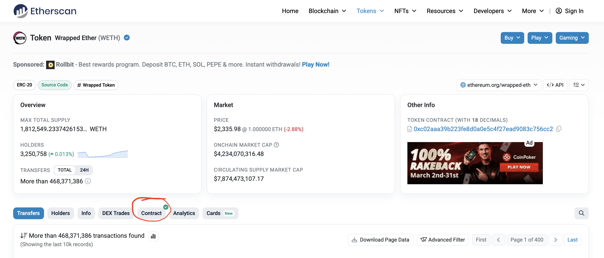

# **Deploy & Go - From Contract to App**

Now we got the solidity and web assembly smart contracts ready, but it’s still not an app that is ready for users. Users don’t want to interact with our contracts directly, they want a nice UI to go with it. So in this last module we’ll cover just that. For this, we will use React TypeScript and the [wagmi](https://wagmi.sh) library to interact with an Ethereum smart contract, then you will get challenges to implement a frontend for your previous deployed contracts. So for the demonstration we will be using the WETH contract on the [SuperPosition](https://superposition.so/) testnet and write some connectors for read and write functions, but first things first; lets start by installing wagmi. This guide will assume that you have [pnpm](https://pnpm.io) installed on your computer, so if you don’t, make sure to head to their website and install it. Next up, in your terminal, run the following command:

```bash
pnpm add wagmi viem@2.x @tanstack/react-query
```

This installs wagmi and the relevant dependencies. Next up, you write this command:

```bash
pnpm create wagmi
```

This will prompt you with a few questions, you can firstly chose whatever project name you see fitting, but we’ll chose weth-test. Next up, you can chose between TypeScript frameworks, here you should chose “React”. Last question will be about the variant of React, and here you should chose “Vite”. After this, you should see an output that ends something like:

```bash
Done. Now run:

  cd weth-test
  pnpm install
  pnpm run dev
```

If you cd into weth-test as instructed, it should contain a src/ directory that should look like this:

```bash
src/
├── App.tsx
├── index.css
├── main.tsx
├── vite-env.d.ts
└── wagmi.ts
```

This is boilerplate for our app that we’re about to write. While you’re here, don’t forget to follow the second part of the instruction and run “pnpm install” too. This will build the project for you. After this, you can open up wagmi.ts in your favorite text editor. Lets start by reading this:

```tsx
import { createConfig, http } from 'wagmi'
import { mainnet, sepolia } from 'wagmi/chains'

export const config = createConfig({
  chains: [mainnet, sepolia],
  transports: {
    [mainnet.id]: http(),
    [sepolia.id]: http(),
  },
})

declare module 'wagmi' {
  interface Register {
    config: typeof config
  }
}
```

This is the chain configuration for our dapp. If you want to understand everything here at a deeper level, head on to [this link](https://wagmi.sh/react/getting-started#create-config). As you can see, this only supports mainnet and sepolia. Feel free to use the [LSP goto definition](https://tomassetti.me/go-to-definition-in-the-language-server-protocol/) to study the “mainnet” and “sepolia” chain types. We want to change these out for a custom chain we define for SuperPosition. In order to do that, we need to import “injected” from wagmi, and “defineChain” from viem. While we’re doing this, we cann remove the “mainnet” and “sepolia” imports too. The import section should now look like this:

```tsx
import { createConfig, http, injected } from "wagmi";
import { defineChain } from "viem";
```

After this, we’ll use the “defineChain” to create our custom chain. We’ll need information about our chain that we can fetch from [ChainList](https://chainlist.org). Creating the chain will look like this: 

```tsx
export const superPosition = defineChain({
  id: 98985,
  name: "Super Position Testnet",
  nativeCurrency: {
    name: "Super Position",
    symbol: "SPN",
    decimals: 18,
  },
  rpcUrls: {
    default: {
      http: ["https://testnet-rpc.superposition.so"],
    },
  },
  blockExplorers: {
    default: {
      name: "Blockscout",
      url: "https://testnet-explorer.superposition.so/",
    },
  },
});
```

After this we replace “mainnet” and “sepolia” in our config to “superPosition”. Also, for ease of use lets add the line:

```tsx
connectors: [injected()],
```

The full file should now look something like: 

```tsx
import { createConfig, http, injected } from "wagmi";
import { defineChain } from "viem";

export const superPosition = defineChain({
  id: 98985,
  name: "Super Position Testnet",
  nativeCurrency: {
    name: "Super Position",
    symbol: "SPN",
    decimals: 18,
  },
  rpcUrls: {
    default: {
      http: ["https://testnet-rpc.superposition.so"],
    },
  },
  blockExplorers: {
    default: {
      name: "Blockscout",
      url: "https://testnet-explorer.superposition.so/",
    },
  },
});

export const config = createConfig({
  chains: [superPosition],
  connectors: [injected()],
  transports: {
    [superPosition.id]: http(),
  },
});

declare module "wagmi" {
  interface Register {
    config: typeof config;
  }
}
```

After this in the terminal, lets run:

```bash
pnpm run dev
```

This will open up a [localhost](http://localhost) port. Open it up in your favorite browser and watch how it looks. You should see a minimal UI that that only allows you to connect your wallet. If you see a button that says “injected” that means you’ve succeeded with the first step!

This is good, but we still have one problem. If we are not on the SuperPosition testnet in our metamask when we connect our wallets, it will try to connect to whatever chain we’re currently on. We don’t want this, we want the chain to switch correctly after we connected. Luckily, wagmi has a hook for this; useSwitchChain(). Lets open App.tsx, and in our wagmi imports add “useSwitchChain”. While were at it, also import the SuperPosition chain config that we just created. Then, by the start of our App function add the line:

```tsx
  const { mutate: switchChain } = useSwitchChain();
```

The start of the file should now look like this:

```tsx
import { useConnect, useConnection, useConnectors, useDisconnect, useSwitchChain } from 'wagmi'
import { superPosition } from "./wagmi"

function App() {
  const connection = useConnection()
  const { mutate: switchChain } = useSwitchChain()
  const { connect, status, error } = useConnect()
  const connectors = useConnectors()
  const { disconnect } = useDisconnect()
```

After this, lets navigate down to the part that looks like this:

```tsx
<div>
  <h2>Connect</h2>
  {connectors.map((connector) => (
    <button
      key={connector.uid}
      onClick={() => connect({ connector })}
      type="button"
    >
      {connector.name}
    </button>
  ))}
  <div>{status}</div>
  <div>{error?.message}</div>
</div>
```

We want to modify the line:

```tsx
onClick={() => connect({ connector })}
```

After the fist action that succeeds, we want the chain to switch automatically. Inside of the connect() parentheses, after the closing curly bracket after { connector }, we add a comma, and a new line.  Open up new curly brackets and add:

```tsx
{
  onSuccess: () => {
    switchChain({ chainId: superPosition.id });
  },
},
```

Now run:

```bash
pnpm prettier --write .
```

Then the full file should look like this:

```tsx
import { superPosition } from "./wagmi";
import {
  useConnect,
  useConnection,
  useConnectors,
  useDisconnect,
  useSwitchChain,
} from "wagmi";

function App() {
  const connection = useConnection();
  const { mutate: switchChain } = useSwitchChain();
  const { connect, status, error } = useConnect();
  const connectors = useConnectors();
  const { disconnect } = useDisconnect();

  return (
    <>
      <div>
        <h2>Connection</h2>

        <div>
          status: {connection.status}
          <br />
          addresses: {JSON.stringify(connection.addresses)}
          <br />
          chainId: {connection.chainId}
        </div>

        {connection.status === "connected" && (
          <button type="button" onClick={() => disconnect()}>
            Disconnect
          </button>
        )}
      </div>

      <div>
        <h2>Connect</h2>
        {connectors.map((connector) => (
          <button
            key={connector.uid}
            onClick={() =>
              connect(
                { connector },
                {
                  onSuccess: () => {
                    switchChain({ chainId: superPosition.id });
                  },
                },
              )
            }
            type="button"
          >
            {connector.name}
          </button>
        ))}
        <div>{status}</div>
        <div>{error?.message}</div>
      </div>
    </>
  );
}

export default App;
```

Now run:

```bash
pnpm run dev
```

And navigate to the browser to try our change. Now when you connect your wallet it should automatically change the active chain in our wallet.

For the next step, we’ll start adding our [ABI](https://docs.soliditylang.org/en/latest/abi-spec.html) for WETH. The ABI is basically like guardrails on how to format and build our function calls in order to interact with the WETH contract. So we head to the [WETH contract on etherscan](https://etherscan.io/token/0xc02aaa39b223fe8d0a0e5c4f27ead9083c756cc2) and the “contract” button:



After that scroll down until you see the field “Contract ABI” and copy the full contents of the textbox. Then, inside of our src/ directory, create a new directory called “abis”. Inside here, you create a file called weth.ts. Start writing:

```tsx
export const wethAbi = 
```

then paste the huge ABI that you just copied. If you save this file you can go to the terminal and write:

```bash
pnpm prettier --write .
```

This will format everything, and be very helpful when reading through the ABI. After the ABI, add “as const;” so that the start and ends looks like this:

```tsx
export const wethAbi = [
  {
    constant: true,
    inputs: [],
		...
		...
		...
		    inputs: [
      { indexed: true, name: "src", type: "address" },
      { indexed: false, name: "wad", type: "uint256" },
    ],
    name: "Withdrawal",
    type: "event",
  },
 ] as const;

```

Awesome! Now we got almost everything what we need to interact with a WETH contract, but there is one thing missing; the address. Head over to the tokens section of the [SuperPosition testnet explorer](https://testnet-explorer.superposition.so/tokens). Sidenote here: super positions native token is “SPN” and not “ETH”, so we’re looking for the Wrapped SuperPosition token here, namely [“WSPN”](https://testnet-explorer.superposition.so/token/0x22b9fa698b68bBA071B513959794E9a47d19214c). Don’t worry, this contract works just like the regular WETH contract. So the address we found should be: 0x22b9fa698b68bBA071B513959794E9a47d19214c.

Now, in our app, lets display the total supply of super position tokens that exists today. In order to do that, head over to our App.tsx, and underneath the imports, lets add a constant with our address:

```tsx
const WETH_ADDRESS = "0x22b9fa698b68bBA071B513959794E9a47d19214c" as const;
```

Awesome! Now we can start actually reading and writing to the contract! Lets continue to get our total supply display. In order to do that we need to fetch 2 things; the actual total supply and the decimals of the contract. In most cases the decimals are 18, but this changes from contract to contract and the most robust solution is to fetch it from the contract, so we know with certainty that we have the correct amount. To read from contract, wagmi has a [useReadContract hook](https://wagmi.sh/react/api/hooks/useReadContract). First, you need to add this to our imports. Also at the same time, add the wethAbi to our imports too.

After this we need to add this pattern to set up the hook for our total supply:

```tsx
const { data: totalSupply } = useReadContract({
  address: WETH_ADDRESS,
  abi: wethAbi,
  functionName: "totalSupply",
});
```

And our decimals:

```tsx
const { data: decimals } = useReadContract({
  address: WETH_ADDRESS,
  abi: wethAbi,
  functionName: "decimals",
});
```

At the very end of the inline html of the App return, add:

```tsx
<div>
  <p>Current total supply is {totalSupply}</p>
</div>
```

Now rerun the pnpm run dev and open the browser again. Now you should see something like:

> Current total supply is 3539976520805007267050570
> 

This is good, but not properly formatted. Viem ships with a function to format integers correctly, called “formatUnits”. Add to the top of the file:

```tsx
import { formatUnits } from "viem";
```

Before we format we need to understand one thing about the wagmi useReadContract hook. when we are interacting with a blockchain, we are actually making http requests, and there is no certainty that it actually will get anything back, there are a lot of things that can go wrong when sending a request over the internet. Therefore, the function will return EITHER what we’re expecting OR it will give us a Javascript “undefined”. Therefore, before parsing the units we have to use a way to safely. You can do this in a lot of ways, but I want to do this using [ternary operations](https://developer.mozilla.org/en-US/docs/Web/JavaScript/Reference/Operators/Conditional_operator). Inside of the field we just created lets add:

```tsx
<div>
  {totalSupply !== undefined && decimals !== undefined ? (
    <p>Current total supply is {formatUnits(totalSupply, decimals)}</p>
  ) : (
    <p>Could not get weth total supply</p>
  )}
</div>
```

Now, the supply will only show as long as we have both it and the decimals, as well as being correctly formatted. If anything happened while fetching the data, we will instead see “could not get weth total supply”. You can now rerun our pnpm run dev and check out the website again. It should now say:

> Current total supply is 3539976.52080500726705057
> 

Nice. Really nice. Lets now make sure we can mint from the weth contract. For this, we need the intuitively named [useWriteContract](https://wagmi.sh/react/api/hooks/useWriteContract). The wagmi documentation comes with a nice step by step guide to [use this hook](https://wagmi.sh/react/guides/write-to-contract), so make sure to check that out. Firstly, in our wagmi imports, lets add useWriteContract:

```tsx
import {
  useConnect,
  useConnection,
  useConnectors,
  useDisconnect,
  useSwitchChain,
  useReadContract,
  useWriteContract
} from "wagmi";

```

Then, lets create a new component, and follow the guide to write it. By following this you should end up with a component looking something like this:

```tsx
function MintWeth() {
  const { data: hash, writeContract } = useWriteContract();
  async function submit(e: React.SubmitEvent<HTMLFormElement>) {
    e.preventDefault();
    const formData = new FormData(e.target as HTMLFormElement);
    const amountToMint = formData.get("amountToMint") as string;
    writeContract({
      address: WETH_ADDRESS,
      abi: wethAbi,
      functionName: "deposit",
    });
  }
  return (
    <>
      <p>Mint WSPN!!!</p>
      <form onSubmit={submit}>
        <label htmlFor="amountToMint">Amount</label>
        <input
          type="number"
          step="0.001"
          id="amountToMint"
          name="amountToMint"
        />
        <button type="submit">Mint!</button>
      </form>
    </>
  );
}
```

However, there is one thing missing. If we go back to the weth contract on the etherscan link and read the deposit function you can see that it looks like this:

```solidity
function deposit() public payable {
	balanceOf[msg.sender] += msg.value;
  Deposit(msg.sender, msg.value);
}
```

See the word “payable”. This means that users can send ether to it, and reach it using msg.value. Therefore, we must pass our amountToMint as the value of the transaction we’re sending. Also, our users should be able to define it in decimal format, but the function will need it in integer format. Fear not, viem got us covered again. Inside our viem imports add parseEthers:

```tsx
import { formatUnits, parseEther } from "viem";
```

Then lastly add to our writeContract:

```tsx
writeContract({
  address: WETH_ADDRESS,
  abi: wethAbi,
  functionName: "deposit",
  value: parseEther(amountToMint),
});
```

Now the full component should look like:

```solidity
function MintWeth() {
  const { data: hash, writeContract } = useWriteContract();
  async function submit(e: React.SubmitEvent<HTMLFormElement>) {
    e.preventDefault();
    const formData = new FormData(e.target as HTMLFormElement);
    const amountToMint = formData.get("amountToMint") as string;
    writeContract({
      address: WETH_ADDRESS,
      abi: wethAbi,
      functionName: "deposit",
      value: parseEther(amountToMint),
    });
  }
  return (
    <>
      <p>Mint WSPN!!!</p>
      <form onSubmit={submit}>
        <label htmlFor="amountToMint">Amount</label>
        <input
          type="number"
          step="0.001"
          id="amountToMint"
          name="amountToMint"
        />
        <button type="submit">Mint!</button>
      </form>
    </>
  );
}
```

Lastly, underneath that ternary operation tag we just wrote in the App component, add our MintWeth component:

```tsx
<div>
  {totalSupply !== undefined && decimals !== undefined ? (
    <p>Current total supply is {formatUnits(totalSupply, decimals)}</p>
  ) : (
    <p>Could not get weth price</p>
  )}
  <MintWeth />
</div>
```

Now the full App.tsx file should look like this:

```tsx
import {
  useConnect,
  useConnection,
  useConnectors,
  useDisconnect,
  useSwitchChain,
  useReadContract,
  useWriteContract,
} from "wagmi";
import { superPosition } from "./wagmi";
import { wethAbi } from "./abis/weth";
import { formatUnits, parseEther } from "viem";

const WETH_ADDRESS = "0x22b9fa698b68bBA071B513959794E9a47d19214c" as const;

function MintWeth() {
  const { data: hash, writeContract } = useWriteContract();
  async function submit(e: React.SubmitEvent<HTMLFormElement>) {
    e.preventDefault();
    const formData = new FormData(e.target as HTMLFormElement);
    const amountToMint = formData.get("amountToMint") as string;
    writeContract({
      address: WETH_ADDRESS,
      abi: wethAbi,
      functionName: "deposit",
      value: parseEther(amountToMint),
    });
  }
  return (
    <>
      <p>Mint WSPN!!!</p>
      <form onSubmit={submit}>
        <label htmlFor="amountToMint">Amount</label>
        <input
          type="number"
          step="0.001"
          id="amountToMint"
          name="amountToMint"
        />
        <button type="submit">Mint!</button>
      </form>
    </>
  );
}

function App() {
  const connection = useConnection();
  const { mutate: switchChain } = useSwitchChain();
  const { connect, status, error } = useConnect();
  const connectors = useConnectors();
  const { disconnect } = useDisconnect();

  const { data: totalSupply } = useReadContract({
    address: WETH_ADDRESS,
    abi: wethAbi,
    functionName: "totalSupply",
  });

  const { data: decimals } = useReadContract({
    address: WETH_ADDRESS,
    abi: wethAbi,
    functionName: "decimals",
  });

  return (
    <>
      <div>
        <h2>Connection</h2>

        <div>
          status: {connection.status}
          <br />
          addresses: {JSON.stringify(connection.addresses)}
          <br />
          chainId: {connection.chainId}
        </div>

        {connection.status === "connected" && (
          <button type="button" onClick={() => disconnect()}>
            Disconnect
          </button>
        )}
      </div>

      <div>
        <h2>Connect</h2>
        {connectors.map((connector) => (
          <button
            key={connector.uid}
            type="button"
            onClick={() =>
              connect(
                { connector },
                {
                  onSuccess: () => {
                    switchChain({ chainId: superPosition.id });
                  },
                },
              )
            }
          >
            {connector.name}
          </button>
        ))}
        <div>{status}</div>
        <div>{error?.message}</div>
      </div>
      <div>
        {totalSupply !== undefined && decimals !== undefined ? (
          <p>Current total supply is {formatUnits(totalSupply, decimals)}</p>
        ) : (
          <p>Could not get weth price</p>
        )}
        <MintWeth />
      </div>
    </>
  );
}

export default App;
```

Now you can run pnpm run dev again, and see it update on the app. Try minting a few WSPN! 

What you can do now, is following that guide to writing to contracts in fully, and add loading state, transaction receipt and error handling. It should look like this:

```tsx
function MintWeth() {
  const { data: hash, isPending, writeContract, error } = useWriteContract();
  async function submit(e: React.SubmitEvent<HTMLFormElement>) {
    e.preventDefault();
    const formData = new FormData(e.target as HTMLFormElement);
    const amountToMint = formData.get("amountToMint") as string;
    writeContract({
      address: WETH_ADDRESS,
      abi: wethAbi,
      functionName: "deposit",
      value: parseEther(amountToMint),
    });
  }

  const { isLoading: isConfirming, isSuccess: isConfirmed } =
    useWaitForTransactionReceipt({ hash });

  return (
    <>
      <p>Mint WSPN!!!</p>
      <form onSubmit={submit}>
        <label htmlFor="amountToMint">Amount</label>
        <input
          type="number"
          step="0.001"
          id="amountToMint"
          name="amountToMint"
        />
        <button type="submit" disabled={isPending}>
          {isPending ? "Confirming..." : "Mint!"}
        </button>
        {hash && <div>Transaction Hash: {hash}</div>}
        {isConfirming && <div>Waiting for confirmation...</div>}
        {isConfirmed && <div>Transaction confirmed.</div>}
        {error && (
          <div>
            {" "}
            Error: {(error as BaseError).shortMessage || error.message}{" "}
          </div>
        )}
      </form>
    </>
  );
}
```

With the completed imports being:

```tsx
import {
  useConnect,
  useConnection,
  useConnectors,
  useDisconnect,
  useSwitchChain,
  useReadContract,
  useWriteContract,
  useWaitForTransactionReceipt,
  type BaseError,
} from "wagmi";
import { superPosition } from "./wagmi";
import { wethAbi } from "./abis/weth";
import { formatUnits, parseEther } from "viem";
```

The app is looking good, but there is something that still bugs me. We cant see our own WSPN balance. It feels unintuitive to just remember how much WSPN we minted, right? Lets use the balanceOf function in the weth contract to fetch this. The balance of function takes an address as the argument, so that it knows what wallet to check the balance of. The wallet connected through the App is actually reachable in our already existing “connection” constant. Lets unwrap it safely first. Set the cursor underneath the decimals useReadContract block, and write:

```tsx
const userAddress = connection.addresses?.[0];
```

As you can see in the [wagmi guide for reading smart contracts](https://wagmi.sh/react/guides/read-from-contract), you send args as an array from “args: ”. However, our connection wont always hold the address. It wont know it until we’re connected. Therefore we have to have some conditionals in our initiation of this constant. This solution is a bit hacky, and I am sure that there are more proper ones, but for the sake of this demo lets stick to it. In args, add so that the full call looks like this:

```tsx
const { data: userBalanceOfWeth } = useReadContract({
  address: WETH_ADDRESS,
  abi: wethAbi,
  functionName: "balanceOf",
  args: userAddress ? [userAddress] : undefined,
});
```

However, we can do better than this, since we cant send undefined as an argument really. TanStack, which is what wagmi partly is built on top of, has a clever argument you can pass with it, so that you have a conditional for a query to be made. Adding this would look like this:

```tsx
  const { data: userBalanceOfWeth } = useReadContract({
    address: WETH_ADDRESS,
    abi: wethAbi,
    functionName: "balanceOf",
    args: userAddress ? [userAddress] : undefined,
    query: {
      enabled: !!userAddress
    }
  });
```

Now, this query will ONLY be called if we have a connected wallet to our page. Now, under our MintWeth component, lets add:

```tsx
{connection.status === "connected" && (
  <p>Balance of WSPN: {userBalanceOfWeth}</p>
)}
```

This will only render the users balance if the connection status is “connected”. Now the full code should look like this:

```tsx
import {
  useConnect,
  useConnection,
  useConnectors,
  useDisconnect,
  useSwitchChain,
  useReadContract,
  useWriteContract,
  useWaitForTransactionReceipt,
  type BaseError,
} from "wagmi";
import { superPosition } from "./wagmi";
import { wethAbi } from "./abis/weth";
import { formatUnits, parseEther } from "viem";

const WETH_ADDRESS = "0x22b9fa698b68bBA071B513959794E9a47d19214c" as const;

function MintWeth() {
  const { data: hash, isPending, writeContract, error } = useWriteContract();
  async function submit(e: React.SubmitEvent<HTMLFormElement>) {
    e.preventDefault();
    const formData = new FormData(e.target as HTMLFormElement);
    const amountToMint = formData.get("amountToMint") as string;
    writeContract({
      address: WETH_ADDRESS,
      abi: wethAbi,
      functionName: "deposit",
      value: parseEther(amountToMint),
    });
  }

  const { isLoading: isConfirming, isSuccess: isConfirmed } =
    useWaitForTransactionReceipt({ hash });

  return (
    <>
      <p>Mint WSPN!!!</p>
      <form onSubmit={submit}>
        <label htmlFor="amountToMint">Amount</label>
        <input
          type="number"
          step="0.001"
          id="amountToMint"
          name="amountToMint"
        />
        <button type="submit" disabled={isPending}>
          {isPending ? "Confirming..." : "Mint!"}
        </button>
        {hash && <div>Transaction Hash: {hash}</div>}
        {isConfirming && <div>Waiting for confirmation...</div>}
        {isConfirmed && <div>Transaction confirmed.</div>}
        {error && (
          <div>
            {" "}
            Error: {(error as BaseError).shortMessage || error.message}{" "}
          </div>
        )}
      </form>
    </>
  );
}

function App() {
  const connection = useConnection();
  const { mutate: switchChain } = useSwitchChain();
  const { connect, status, error } = useConnect();
  const connectors = useConnectors();
  const { disconnect } = useDisconnect();

  const { data: totalSupply } = useReadContract({
    address: WETH_ADDRESS,
    abi: wethAbi,
    functionName: "totalSupply",
  });

  const { data: decimals } = useReadContract({
    address: WETH_ADDRESS,
    abi: wethAbi,
    functionName: "decimals",
  });

  const userAddress = connection.addresses?.[0];

  const { data: userBalanceOfWeth } = useReadContract({
    address: WETH_ADDRESS,
    abi: wethAbi,
    functionName: "balanceOf",
    args: userAddress ? [userAddress] : undefined,
    query: {
      enabled: !!userAddress
    }
  });

  return (
    <>
      <div>
        <h2>Connection</h2>

        <div>
          status: {connection.status}
          <br />
          addresses: {JSON.stringify(connection.addresses)}
          <br />
          chainId: {connection.chainId}
        </div>

        {connection.status === "connected" && (
          <button type="button" onClick={() => disconnect()}>
            Disconnect
          </button>
        )}
      </div>

      <div>
        <h2>Connect</h2>
        {connectors.map((connector) => (
          <button
            key={connector.uid}
            type="button"
            onClick={() =>
              connect(
                { connector },
                {
                  onSuccess: () => {
                    switchChain({ chainId: superPosition.id });
                  },
                },
              )
            }
          >
            {connector.name}
          </button>
        ))}
        <div>{status}</div>
        <div>{error?.message}</div>
      </div>
      <div>
        {totalSupply !== undefined && decimals !== undefined ? (
          <p>Current total supply is {formatUnits(totalSupply, decimals)}</p>
        ) : (
          <p>Could not get weth price</p>
        )}
        <MintWeth />
        {connection.status === "connected" && (
          <p>Balance of WSPN: {userBalanceOfWeth}</p>
        )}
      </div>
    </>
  );
}

export default App;
```

Now, lastly, run the pnpm run dev command and try the app out!

Wow, we made a lot of progress here. We now know hot to configure wagmi, set up contracts and interact with them. For the next challenge, I want you to take the contracts that you already deployed, and write your own front end for them. Take this as an opportunity to experiment and learn, and let your curiosity lead you.
