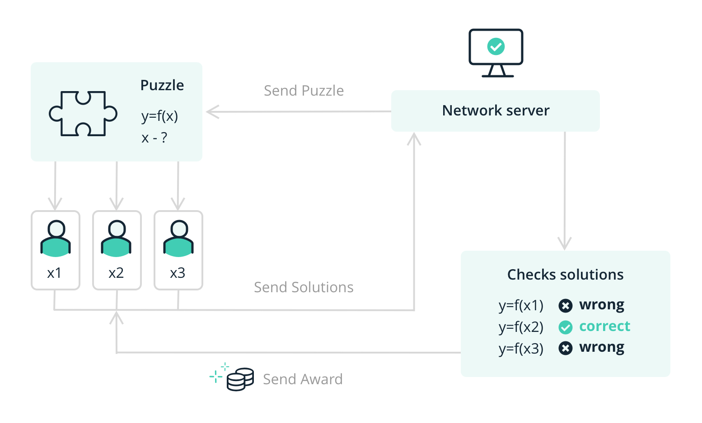
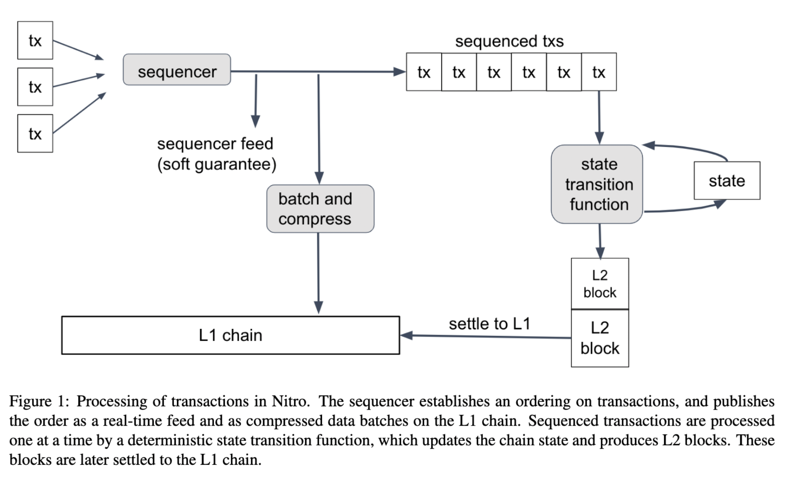
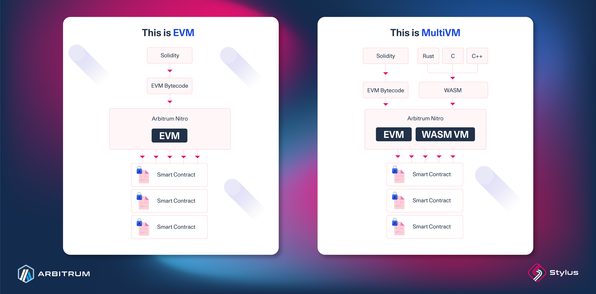
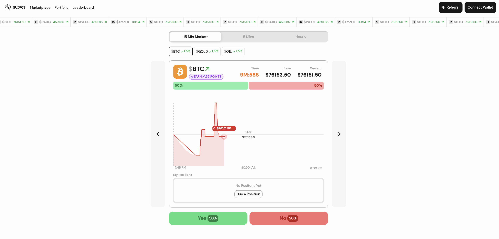

# Arbitrum’s role in the Ethereum roadmap

In 2009, an anonymous developer under the pseudonym [Satoshi Nakamoto](https://en.wikipedia.org/wiki/Satoshi_Nakamoto) created [Bitcoin](https://en.wikipedia.org/wiki/Bitcoin), a decentralized ledger to send money independent of banks and centralized actors. Through [clever use of cryptography](https://en.wikipedia.org/wiki/Proof_of_work), he created a way for multiple peers to record and verify transactions and without direct coordination reach a consensus that anyone can verify. 

Although this value proposition alone was huge, Bitcoin was still very limited. All this safety and transparency went to a minimal ledger only recording transactions, and it didn’t take long for people to think about how this technology could be extended. One of these people was [Vitalik Buterin](https://en.wikipedia.org/wiki/Vitalik_Buterin), who asked the question:

“What if instead of verifying transactions, we could use blockchains to verify computations?”

This question led to [Ethereum](https://ethereum.org), which would be a shared world computer, as opposed to Bitcoin's transaction ledger. They introduced the [EVM](https://ethereum.org/developers/docs/evm/) (Ethereum Virtual Machine), which is an [ISA](https://en.wikipedia.org/wiki/Instruction_set_architecture) (Instruction Set Architecture), basically a tiny CPU, which serves as a decentralized VM. The blockchain consensus protocol now verified opcodes instead of just transactions. This introduced a new concept: the blockchain is now programmable. This gave people a distributed machine people could program that is useful for governance, finance and more. People were inventing DeFi protocols, [DAOs](https://en.wikipedia.org/wiki/Decentralized_autonomous_organization) (Decentralized Autonomous Organizations) and [NFTs](https://en.wikipedia.org/wiki/Non-fungible_token) (Non Fungible Tokens) thanks to this this new programability. While Bitcoin felt as the first step of the blockchain evolution, Ethereum paved the way as the second step.

But while many thought of Ethereum as an upgrade from Bitcoin, its shortcomings became more apparent. Firstly, both users and developers started expecting higher speeds from their blockchain applications than Ethereums 12 second blocks could offer. Also as usage and hype grew, the main net gas fees became increasingly higher, pricing a lot of users out. Aside from this, the programmability of Ethereum left things to be desired. The architecture still enforced a lot of limitations in terms of gas costs for complex logic, programs having to be small and developers having to learn a lot of niche domain knowledge in order to work on it, like having to use a new language, [Solidity](https://www.soliditylang.org), a smart contract programming language that they might not have worked in before. Don’t get me wrong, Solidity is awesome, but it is also restrictive and solely used for building smart contracts on an EVM compatible chain and nothing else. 

Given these restrictions, a lot of people started to work on blockchains that would be the 3rd step in the blockchain journey, some on their own native blockchain designs, and some building on top of the EVM technology and extending it further. Ethereum Foundation themselves presented the “[rollup centric roadmap](https://ethereum-magicians.org/t/a-rollup-centric-ethereum-roadmap/4698)”, where the idea is that main net Ethereum should be though of as a settlement layer, and that execution should be made on a layer on top of that, that trades away some of Ethereums security for speed and improved gas fees in different ways. 

One of these chains is [Arbitrum One](https://arbitrum.io), a EVM compatible [optimistic rollup](https://ethereum.org/developers/docs/scaling/optimistic-rollups/) on top of Ethereum. What does this mean? Let’s break it down! “EVM compatible” means that it can run any EVM byte code that main net Ethereum can. “Rollup” means that it is a layer on top of Ethereum, that ultimately settles on Ethereum.

“Optimistic” is the most interesting definition here.

On main net Ethereum every transaction gets validated by every node. This makes the chain extremely secure, but it doesn’t scale very well. If you doubled the amount of nodes, you wouldn’t double the amount of throughput, you just doubled the amount of machines doing the same work. In an optimistic rollup, the system remains optimistic that the person posting a compute result to the chain is acting truthfully, and this result will not be rechecked automatically. In fact, the transaction will be executed off-chain, and only the result will be posted on-chain. The party posting the computation result is staking money on the fact that they are acting truthfully, and once a result is posted, others can challenge it. If, through this process, it turns out that the party posting the result lied, the correct state will be enforced by dispute, and the dishonest party will have part of or all of their stake lost to the challenger.

Another way that Arbitrum One and main net Ethereum differ is that in Ethereum land, the validator is the one choosing the order of transactions within the block that it is producing. In Arbitrum One, there is a centralized sequencer that receives all transactions, publishes a sequence feed that anyone can subscribe to, then executes a state transition function that will produce a block. After this, transactions are batched and compressed in the order the sequencer chose and then this piece of data is sent to main net Ethereum. 

The pros here are that users are offered a very low latency response to their transactions, even before the state transition function is executed, as long as they trust the sequencer. The con is in the latter part of last sentence; trust. As things are today, the sequencer is ran centralized by Offchain Labs, giving them a final say in the order of transactions on the chain, and users therefore must trust Offchain Labs when transacting on the chain. However, this is all part of a incremental decentralization rollout, which once finalized will provide Arbitrum with a high level of decentralization. Arbitrum separates who orders transactions from who verifies correctness.

While scaling Ethereum is cool and all, Arbitrum’s mission in elevating the main net chain to new possibilities didn’t stop there. In February 2023, Arbitrum Stylus was announced, an ambitious project to make Arbitrum One the first dual-VM blockchain, serving not only the EVM, but also a native code runtime. 32-bit [WASM](https://webassembly.org) is converted to native code for execution, and contracts are not interpreted on the fly unlike the EVM. 

Heavy emphasis on the fact that there are two different VMs that are seamlessly integrating together. This means that each contract will be executed in its most efficient (and therefore cheaper and faster) runtime, while still seamlessly interacting with other contracts. WASM to native code then native code execution is inherently better performing in this context. The WASM toolchain is better developed after a decade of frontend use, the ISA is more similar to the native host, and the word size is 32-bit, meaning better performance generally on 64-bit CPUs. After transition, these benefits become free. The code is not interpreted, since the EVM lacks an optimizing JIT interpreter, so it performs better generally (no interpreter overhead). Smart contracts remain on-chain, and the runtime that's used to run the code is determined by a magic byte at the beginning of the contract code.

What this means is that any programmer able to write in a language that can compile to WASM can now seamlessly tap into smart contract development. This includes languages like [Rust](https://rust-lang.org), [Zig](https://ziglang.org) and [C](https://en.wikipedia.org/wiki/C_(programming_language)), which expands the developer pool much further than Solidity ever could. Developers that are new to web3 now have an easy way to start experimenting with smart contracts, while more seasoned smart contract developers now have an EVM with superpowers they can experiment with.

Gatekeeping is now a thing of the past, and Stylus is for both the web3 newcomer, as well as the Solidity guru looking to extend their smart contracts to do things that weren’t possible before.

Along side this, Arbitrum One also introduced something called Orbit Chains. If you think about how Arbitrum One batched and compressed the sequenced transactions into a blob of data that then is posted to the Ethereum main net, an orbit chain is a chain that works the same way, but will post its blob to the Arbitrum One chain, thereby settling there. This offers further scalability and customization for dApp developers. The idea here is that anyone can spin up their own dedicated app specific chain as an Arbitrum Orbit Chain. These chains can have their core logic being modified, and extended even further to fit the business logic of the dapp they are supposed to support. This allows Arbitrum itself to scale horizontally, since not all transactions need to be executed on the same chain anymore.

This developer flexibility has already enabled a wave of new designs.

One interesting example is [Superposition](https://superposition.so), an Orbit Chain built as a layer 3 on top of Arbitrum. It is designed with capital efficiency and liquidity incentives at its core, featuring a native [AMM](https://blog.uniswap.org/what-is-an-automated-market-maker)/[orderbook](https://en.wikipedia.org/wiki/Central_limit_order_book) hybrid as well as yield-bearing wrapped assets. It also serves as the home base for the prediction market 9lives, whose codebase pushes the Stylus dual-VM model to its limits. For anyone interested in what becomes possible in a dual-runtime environment, it is well worth studying.

Another example is [Robinhood](https://robinhood.com/us/en/newsroom/robinhood-chain-launches-public-testnet/), which is building infrastructure for its European offering using its own Orbit chain, specifically designed for trading tokenized stocks. This allows users to interact with blockchain-based systems without needing to understand or even be aware of the underlying technology.

A more grassroots example is [Peanut Protocol](https://peanut.me), a payment and off-ramp solution with strong adoption in Argentina and Brazil. At Devconnect Buenos Aires 2025, it was one of the few applications I saw being used consistently in real-world situations. It integrates seamlessly with existing local payment systems like Mercado Pago and Pix, allowing users to pay simply by scanning a QR code. It is one of the clearest examples I have seen of crypto actually working as a usable financial layer in everyday life.
